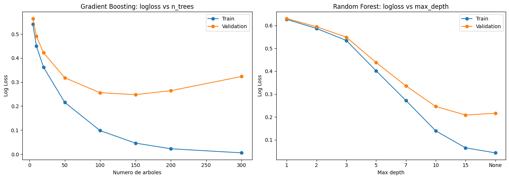
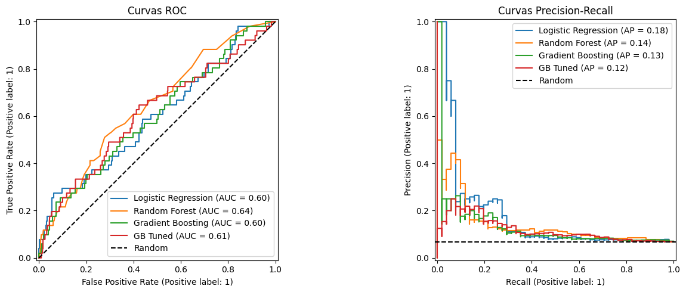
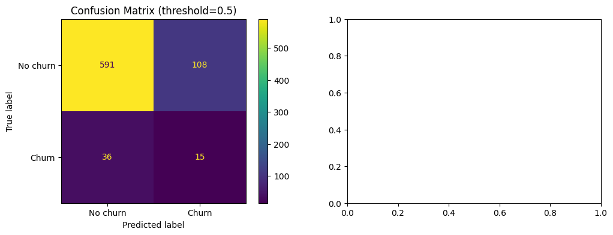
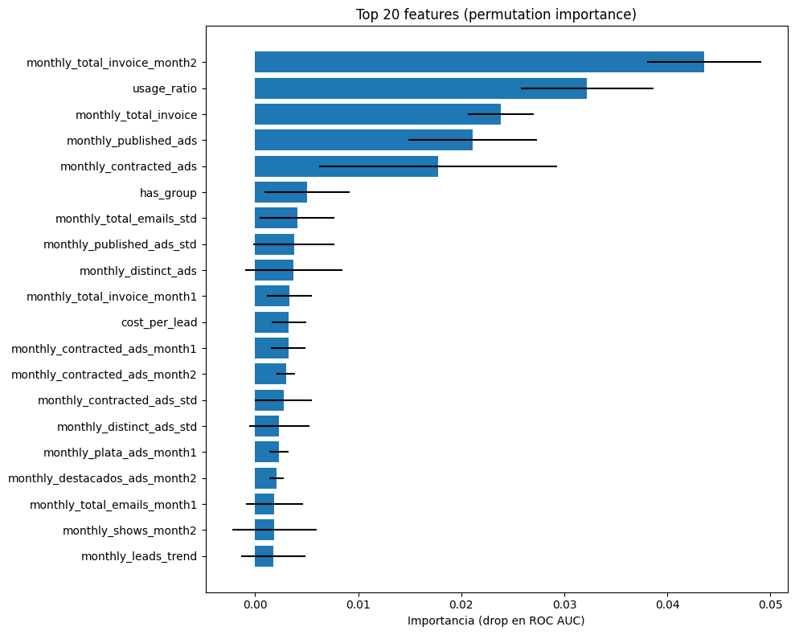
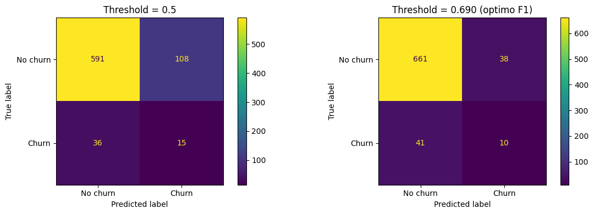
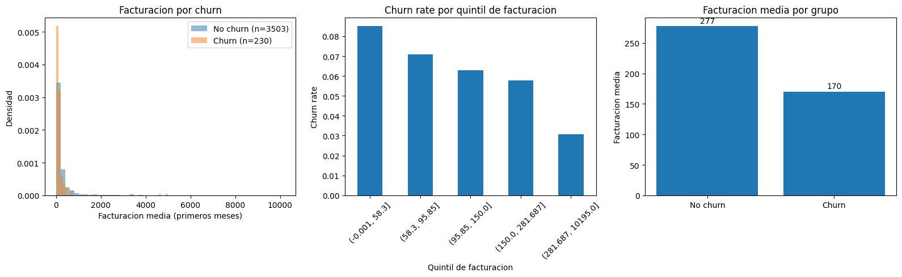

# Evaluacion del modelo de churn (3 meses)

Evaluacion rigurosa del modelo 1: prediccion de churn a 3 meses.

**Contenido:**
1. Datos y feature selection
2. Analisis de leakage en features de month3
3. Comparativa de ventanas temporales
4. Split y justificacion
5. Comparativa de modelos (train vs test)
6. Cross-validation con intervalos de confianza
7. Tuning + Learning curves
8. Feature importance y variable selection
9. Threshold optimo
10. Rendimiento por segmento
11. Perfiles de riesgo
12. Analisis de precio vs churn
13. Performance temporal (walk-forward)
14. Metrica de negocio


```python
import pandas as pd
import numpy as np
import matplotlib.pyplot as plt
import warnings
warnings.filterwarnings('ignore')

from sklearn.model_selection import GroupShuffleSplit, GroupKFold, cross_val_score, RandomizedSearchCV
from sklearn.metrics import (
    roc_auc_score, average_precision_score, classification_report,
    precision_recall_curve, RocCurveDisplay, PrecisionRecallDisplay,
    ConfusionMatrixDisplay
)
from sklearn.dummy import DummyClassifier
from sklearn.linear_model import LogisticRegression
from sklearn.preprocessing import StandardScaler
from sklearn.pipeline import Pipeline
from sklearn.ensemble import RandomForestClassifier, HistGradientBoostingClassifier
from sklearn.inspection import permutation_importance
from scipy.stats import uniform, randint
```

## 1. Datos y feature selection


```python
df = pd.read_parquet("../data/df_3m_churn.parquet", engine="pyarrow")
print(f"Dataset: {df.shape[0]} contratos, {df.shape[1]} columnas")
print(f"\nTarget (churned_3m):")
print(f"  No churn: {(df['churned_3m']==False).sum()} ({(df['churned_3m']==False).mean():.1%})")
print(f"  Churn:    {(df['churned_3m']==True).sum()} ({(df['churned_3m']==True).mean():.1%})")
```

    Dataset: 3733 contratos, 128 columnas
    
    Target (churned_3m):
      No churn: 3503 (93.8%)
      Churn:    230 (6.2%)


```python
# Columnas excluidas:
# - Identificadores y metadata: advertiser_zrive_id, contract_start_date, contract_end_period, etc.
# - Target: churned_3m
# - Leakage post-onboarding: stable_price*, invoice_post_*, n_months_post_onboarding
# - Leakage temporal: features de month3 (ver seccion 2)

NON_FEATURE_COLS = [
    "churned_3m", "advertiser_zrive_id", "contract_start_date",
    "contract_end_period", "contrato_churn_date", "contract_duration_months",
    "advertiser_group_id", "advertiser_province", "is_right_censored", "province_id"
]

post_onboarding_cols = [
    c for c in df.columns
    if c.startswith("invoice_post_") or c.startswith("stable_price") or c == "n_months_post_onboarding"
]

month3_cols = [c for c in df.columns if "month3" in c]

exclude = set(NON_FEATURE_COLS + post_onboarding_cols + month3_cols)
feature_cols = [c for c in df.columns if c not in exclude]

print(f"Features seleccionadas: {len(feature_cols)}")
print(f"Excluidas: {len(exclude)} columnas")
print(f"  - Identificadores/metadata: {len(NON_FEATURE_COLS)}")
print(f"  - Post-onboarding (leakage): {len(post_onboarding_cols)}")
print(f"  - Month3 (leakage temporal): {len(month3_cols)}")
```

    Features seleccionadas: 72
    Excluidas: 56 columnas
      - Identificadores/metadata: 10
      - Post-onboarding (leakage): 30
      - Month3 (leakage temporal): 17


## 2. Analisis de leakage en features de month3

El target `churned_3m` indica si un contrato duro exactamente 3 meses (churn) o mas (no churn).
Esto significa que para todos los contratos que churnan, el mes 3 es su ultimo mes de actividad.

Si la actividad del mes 3 ya refleja el proceso de abandono (ads que bajan a 0, etc.),
el modelo estaria usando la consecuencia del churn para predecir el churn. Eso es leakage.


```python
churned = df[df["churned_3m"] == True]
not_churned = df[df["churned_3m"] == False]

print("Duracion de los contratos churned:")
print(f"  min={churned['contract_duration_months'].min()}, "
      f"max={churned['contract_duration_months'].max()}, "
      f"mean={churned['contract_duration_months'].mean():.1f}")
print(f"  -> 100% de los churned tienen exactamente 3 meses")
print(f"\nEl mes 3 ES el ultimo mes para todos los contratos churned.")

print(f"\npublished_ads_month3 == 0:")
print(f"  Churn:    {(churned['monthly_published_ads_month3']==0).mean():.1%}")
print(f"  No churn: {(not_churned['monthly_published_ads_month3']==0).mean():.1%}")

# Tabla con percentiles (no solo media)
print(f"\nActividad en month3 por percentiles:")
print(f"{'Metrica':<30} {'Grupo':<10} {'p25':>8} {'p50':>8} {'p75':>8} {'mean':>8}")
print("-" * 72)
for metric in ["monthly_published_ads", "monthly_total_invoice", "monthly_leads"]:
    col = f"{metric}_month3"
    for label, subset in [("Churn", churned), ("No churn", not_churned)]:
        vals = subset[col]
        print(f"{metric:<30} {label:<10} {vals.quantile(0.25):>8.1f} {vals.quantile(0.5):>8.1f} {vals.quantile(0.75):>8.1f} {vals.mean():>8.1f}")

```

    Duracion de los contratos churned:
      min=3, max=3, mean=3.0
      -> 100% de los churned tienen exactamente 3 meses
    
    El mes 3 ES el ultimo mes para todos los contratos churned.
    
    published_ads_month3 == 0:
      Churn:    30.0%
      No churn: 7.1%
    
    Actividad en month3 por percentiles:
    Metrica                        Grupo           p25      p50      p75     mean
    ------------------------------------------------------------------------
    monthly_published_ads          Churn           0.0      3.0      9.0     17.4
    monthly_published_ads          No churn        3.0      9.0     26.0     73.9
    monthly_total_invoice          Churn          63.3    112.1    173.3    166.4
    monthly_total_invoice          No churn       78.3    140.0    263.4    293.9
    monthly_leads                  Churn           0.0      3.0     11.0     14.0
    monthly_leads                  No churn        1.0      6.0     15.0     14.6


```python
# Ablation: comparar modelo con y sin month3
from sklearn.model_selection import GroupShuffleSplit, GroupKFold, cross_val_score

all_feature_cols = [c for c in df.columns if c not in set(NON_FEATURE_COLS + post_onboarding_cols)]
no_m3_feature_cols = [c for c in all_feature_cols if "month3" not in c]

y = df["churned_3m"].astype(int)
groups = df["advertiser_zrive_id"]

gss = GroupShuffleSplit(n_splits=1, test_size=0.2, random_state=42)
train_idx, test_idx = next(gss.split(df[all_feature_cols], y, groups))
groups_train = groups.iloc[train_idx]
gkf = GroupKFold(n_splits=5)

scale = (y.iloc[train_idx] == 0).sum() / (y.iloc[train_idx] == 1).sum()
sample_weights = np.where(y.iloc[train_idx] == 1, scale, 1.0)

print(f"{'Config':<25} {'Train AUC':>10} {'CV AUC':>8} {'CV Std':>8} {'Test AUC':>10} {'Test PR-AUC':>12}")
print("=" * 75)

for name, cols in [("Con month3", all_feature_cols), ("Sin month3", no_m3_feature_cols)]:
    X_tr = df[cols].fillna(0).iloc[train_idx]
    X_te = df[cols].fillna(0).iloc[test_idx]
    y_tr, y_te = y.iloc[train_idx], y.iloc[test_idx]

    gb = HistGradientBoostingClassifier(max_iter=200, max_depth=5, learning_rate=0.1, random_state=42)
    gb.fit(X_tr, y_tr, sample_weight=sample_weights)

    train_auc = roc_auc_score(y_tr, gb.predict_proba(X_tr)[:, 1])
    scores = cross_val_score(gb, X_tr, y_tr, cv=gkf, groups=groups_train, scoring="roc_auc", n_jobs=-1)
    y_proba = gb.predict_proba(X_te)[:, 1]

    print(f"{name:<25} {train_auc:>10.3f} {scores.mean():>8.3f} {scores.std():>8.3f} "
          f"{roc_auc_score(y_te, y_proba):>10.3f} {average_precision_score(y_te, y_proba):>12.3f}")

print(f"\nConclucion: excluimos features de month3 para evitar leakage temporal.")
print(f"El modelo pierde algo de ROC AUC pero la PR-AUC se mantiene.")

```

    Config                     Train AUC   CV AUC   CV Std   Test AUC  Test PR-AUC
    ===========================================================================


    Con month3                     1.000    0.775    0.037      0.652        0.207


    Sin month3                     1.000    0.768    0.056      0.631        0.214
    
    Conclucion: excluimos features de month3 para evitar leakage temporal.
    El modelo pierde algo de ROC AUC pero la PR-AUC se mantiene.


## 2b. Comparativa de ventanas temporales (n_months)

El pipeline permite definir el horizonte de churn. Comparamos 3, 4 y 5 meses
para ver como cambia el churn rate y el rendimiento del modelo.
En cada caso excluimos las features del ultimo mes (mismo criterio de leakage).


```python
# Resultados pre-computados corriendo el pipeline con n_months=3,4,5
# y excluyendo features del ultimo mes en cada caso (mismo criterio de leakage)
# Modelo: HistGradientBoosting, 5-fold GroupKFold por advertiser

results_nmonths = pd.DataFrame({
    'n_months': [3, 4, 5],
    'Contratos': [3733, 3367, 2944],
    'Churn': [230, 338, 384],
    'Churn_pct': [6.2, 10.0, 13.0],
    'Features': [72, 88, 103],
    'CV_AUC': [0.717, 0.704, 0.727],
    'CV_Std': [0.031, 0.021, 0.016],
    'CV_PR_AUC': [0.194, 0.217, 0.336],
})

print(f"{'n_months':>8} {'Contratos':>10} {'Churn':>6} {'Churn%':>8} {'Features':>9} {'CV AUC':>8} {'CV Std':>8} {'CV PR-AUC':>10}")
print('=' * 80)
for _, row in results_nmonths.iterrows():
    print(f"{int(row['n_months']):>8} {int(row['Contratos']):>10} {int(row['Churn']):>6} "
          f"{row['Churn_pct']:>7.1f}% {int(row['Features']):>9} "
          f"{row['CV_AUC']:>8.3f} {row['CV_Std']:>8.3f} {row['CV_PR_AUC']:>10.3f}")

print(f'\nA mayor ventana, mas positivos y mejor PR-AUC (0.19 -> 0.34).')
print(f'ROC AUC es similar en los tres (~0.71-0.73).')
print(f'Mantenemos n_months=3 como horizonte principal (prediccion mas temprana).')

```

    n_months  Contratos  Churn   Churn%  Features   CV AUC   CV Std  CV PR-AUC
    ================================================================================
           3       3733    230     6.2%        72    0.717    0.031      0.194
           4       3367    338    10.0%        88    0.704    0.021      0.217
           5       2944    384    13.0%       103    0.727    0.016      0.336
    
    A mayor ventana, mas positivos y mejor PR-AUC (0.19 -> 0.34).
    ROC AUC es similar en los tres (~0.71-0.73).
    Mantenemos n_months=3 como horizonte principal (prediccion mas temprana).


## 3. Split por advertiser

Un mismo advertiser puede tener varios contratos. Si un contrato cae en train y otro
en test, hay leakage por advertiser (el modelo aprende patrones del advertiser, no del contrato).

Usamos `GroupShuffleSplit` para garantizar 0% de overlap entre advertisers de train y test.


```python
X = df[feature_cols].fillna(0)
y = df["churned_3m"].astype(int)
groups = df["advertiser_zrive_id"]

gss = GroupShuffleSplit(n_splits=1, test_size=0.2, random_state=42)
train_idx, test_idx = next(gss.split(X, y, groups))

X_train, X_test = X.iloc[train_idx], X.iloc[test_idx]
y_train, y_test = y.iloc[train_idx], y.iloc[test_idx]
groups_train = groups.iloc[train_idx]

train_advs = set(groups.iloc[train_idx])
test_advs = set(groups.iloc[test_idx])

print(f"Train: {len(X_train)} contratos, {len(train_advs)} advertisers")
print(f"Test:  {len(X_test)} contratos, {len(test_advs)} advertisers")
print(f"Overlap advertisers: {len(train_advs & test_advs)}")
print(f"\nChurn rate train: {y_train.mean():.1%}")
print(f"Churn rate test:  {y_test.mean():.1%}")
```

    Train: 2983 contratos, 2868 advertisers
    Test:  750 contratos, 718 advertisers
    Overlap advertisers: 0
    
    Churn rate train: 6.0%
    Churn rate test:  6.8%


## 4. Comparativa de modelos (train vs test)

Entrenamos varios modelos y comparamos su rendimiento en train y test para
detectar overfitting. Usamos ROC AUC y PR AUC (mas informativa con desbalanceo).


```python
# Sample weights para compensar desbalanceo en modelos de boosting
scale = (y_train == 0).sum() / (y_train == 1).sum()
sample_weights = np.where(y_train == 1, scale, 1.0)

# Entrenar modelos
models = {}

models["Baseline"] = DummyClassifier(strategy="most_frequent")
models["Baseline"].fit(X_train, y_train)

models["Logistic Regression"] = Pipeline([
    ("scaler", StandardScaler()),
    ("lr", LogisticRegression(max_iter=1000, class_weight="balanced", random_state=42))
])
models["Logistic Regression"].fit(X_train, y_train)

models["Random Forest"] = RandomForestClassifier(
    n_estimators=200, class_weight="balanced", random_state=42, n_jobs=-1
)
models["Random Forest"].fit(X_train, y_train)

models["Gradient Boosting"] = HistGradientBoostingClassifier(
    max_iter=200, max_depth=5, learning_rate=0.1, random_state=42
)
models["Gradient Boosting"].fit(X_train, y_train, sample_weight=sample_weights)
```


<style>#sk-container-id-1 {
  /* Definition of color scheme common for light and dark mode */
  --sklearn-color-text: #000;
  --sklearn-color-text-muted: #666;
  --sklearn-color-line: gray;
  /* Definition of color scheme for unfitted estimators */
  --sklearn-color-unfitted-level-0: #fff5e6;
  --sklearn-color-unfitted-level-1: #f6e4d2;
  --sklearn-color-unfitted-level-2: #ffe0b3;
  --sklearn-color-unfitted-level-3: chocolate;
  /* Definition of color scheme for fitted estimators */
  --sklearn-color-fitted-level-0: #f0f8ff;
  --sklearn-color-fitted-level-1: #d4ebff;
  --sklearn-color-fitted-level-2: #b3dbfd;
  --sklearn-color-fitted-level-3: cornflowerblue;
}

#sk-container-id-1.light {
  /* Specific color for light theme */
  --sklearn-color-text-on-default-background: black;
  --sklearn-color-background: white;
  --sklearn-color-border-box: black;
  --sklearn-color-icon: #696969;
}

#sk-container-id-1.dark {
  --sklearn-color-text-on-default-background: white;
  --sklearn-color-background: #111;
  --sklearn-color-border-box: white;
  --sklearn-color-icon: #878787;
}

#sk-container-id-1 {
  color: var(--sklearn-color-text);
}

#sk-container-id-1 pre {
  padding: 0;
}

#sk-container-id-1 input.sk-hidden--visually {
  border: 0;
  clip: rect(1px 1px 1px 1px);
  clip: rect(1px, 1px, 1px, 1px);
  height: 1px;
  margin: -1px;
  overflow: hidden;
  padding: 0;
  position: absolute;
  width: 1px;
}

#sk-container-id-1 div.sk-dashed-wrapped {
  border: 1px dashed var(--sklearn-color-line);
  margin: 0 0.4em 0.5em 0.4em;
  box-sizing: border-box;
  padding-bottom: 0.4em;
  background-color: var(--sklearn-color-background);
}

#sk-container-id-1 div.sk-container {
  /* jupyter's `normalize.less` sets `[hidden] { display: none; }`
     but bootstrap.min.css set `[hidden] { display: none !important; }`
     so we also need the `!important` here to be able to override the
     default hidden behavior on the sphinx rendered scikit-learn.org.
     See: https://github.com/scikit-learn/scikit-learn/issues/21755 */
  display: inline-block !important;
  position: relative;
}

#sk-container-id-1 div.sk-text-repr-fallback {
  display: none;
}

div.sk-parallel-item,
div.sk-serial,
div.sk-item {
  /* draw centered vertical line to link estimators */
  background-image: linear-gradient(var(--sklearn-color-text-on-default-background), var(--sklearn-color-text-on-default-background));
  background-size: 2px 100%;
  background-repeat: no-repeat;
  background-position: center center;
}

/* Parallel-specific style estimator block */

#sk-container-id-1 div.sk-parallel-item::after {
  content: "";
  width: 100%;
  border-bottom: 2px solid var(--sklearn-color-text-on-default-background);
  flex-grow: 1;
}

#sk-container-id-1 div.sk-parallel {
  display: flex;
  align-items: stretch;
  justify-content: center;
  background-color: var(--sklearn-color-background);
  position: relative;
}

#sk-container-id-1 div.sk-parallel-item {
  display: flex;
  flex-direction: column;
}

#sk-container-id-1 div.sk-parallel-item:first-child::after {
  align-self: flex-end;
  width: 50%;
}

#sk-container-id-1 div.sk-parallel-item:last-child::after {
  align-self: flex-start;
  width: 50%;
}

#sk-container-id-1 div.sk-parallel-item:only-child::after {
  width: 0;
}

/* Serial-specific style estimator block */

#sk-container-id-1 div.sk-serial {
  display: flex;
  flex-direction: column;
  align-items: center;
  background-color: var(--sklearn-color-background);
  padding-right: 1em;
  padding-left: 1em;
}


/* Toggleable style: style used for estimator/Pipeline/ColumnTransformer box that is
clickable and can be expanded/collapsed.
- Pipeline and ColumnTransformer use this feature and define the default style
- Estimators will overwrite some part of the style using the `sk-estimator` class
*/

/* Pipeline and ColumnTransformer style (default) */

#sk-container-id-1 div.sk-toggleable {
  /* Default theme specific background. It is overwritten whether we have a
  specific estimator or a Pipeline/ColumnTransformer */
  background-color: var(--sklearn-color-background);
}

/* Toggleable label */
#sk-container-id-1 label.sk-toggleable__label {
  cursor: pointer;
  display: flex;
  width: 100%;
  margin-bottom: 0;
  padding: 0.5em;
  box-sizing: border-box;
  text-align: center;
  align-items: center;
  justify-content: center;
  gap: 0.5em;
}

#sk-container-id-1 label.sk-toggleable__label .caption {
  font-size: 0.6rem;
  font-weight: lighter;
  color: var(--sklearn-color-text-muted);
}

#sk-container-id-1 label.sk-toggleable__label-arrow:before {
  /* Arrow on the left of the label */
  content: "▸";
  float: left;
  margin-right: 0.25em;
  color: var(--sklearn-color-icon);
}

#sk-container-id-1 label.sk-toggleable__label-arrow:hover:before {
  color: var(--sklearn-color-text);
}

/* Toggleable content - dropdown */

#sk-container-id-1 div.sk-toggleable__content {
  display: none;
  text-align: left;
  /* unfitted */
  background-color: var(--sklearn-color-unfitted-level-0);
}

#sk-container-id-1 div.sk-toggleable__content.fitted {
  /* fitted */
  background-color: var(--sklearn-color-fitted-level-0);
}

#sk-container-id-1 div.sk-toggleable__content pre {
  margin: 0.2em;
  border-radius: 0.25em;
  color: var(--sklearn-color-text);
  /* unfitted */
  background-color: var(--sklearn-color-unfitted-level-0);
}

#sk-container-id-1 div.sk-toggleable__content.fitted pre {
  /* unfitted */
  background-color: var(--sklearn-color-fitted-level-0);
}

#sk-container-id-1 input.sk-toggleable__control:checked~div.sk-toggleable__content {
  /* Expand drop-down */
  display: block;
  width: 100%;
  overflow: visible;
}

#sk-container-id-1 input.sk-toggleable__control:checked~label.sk-toggleable__label-arrow:before {
  content: "▾";
}

/* Pipeline/ColumnTransformer-specific style */

#sk-container-id-1 div.sk-label input.sk-toggleable__control:checked~label.sk-toggleable__label {
  color: var(--sklearn-color-text);
  background-color: var(--sklearn-color-unfitted-level-2);
}

#sk-container-id-1 div.sk-label.fitted input.sk-toggleable__control:checked~label.sk-toggleable__label {
  background-color: var(--sklearn-color-fitted-level-2);
}

/* Estimator-specific style */

/* Colorize estimator box */
#sk-container-id-1 div.sk-estimator input.sk-toggleable__control:checked~label.sk-toggleable__label {
  /* unfitted */
  background-color: var(--sklearn-color-unfitted-level-2);
}

#sk-container-id-1 div.sk-estimator.fitted input.sk-toggleable__control:checked~label.sk-toggleable__label {
  /* fitted */
  background-color: var(--sklearn-color-fitted-level-2);
}

#sk-container-id-1 div.sk-label label.sk-toggleable__label,
#sk-container-id-1 div.sk-label label {
  /* The background is the default theme color */
  color: var(--sklearn-color-text-on-default-background);
}

/* On hover, darken the color of the background */
#sk-container-id-1 div.sk-label:hover label.sk-toggleable__label {
  color: var(--sklearn-color-text);
  background-color: var(--sklearn-color-unfitted-level-2);
}

/* Label box, darken color on hover, fitted */
#sk-container-id-1 div.sk-label.fitted:hover label.sk-toggleable__label.fitted {
  color: var(--sklearn-color-text);
  background-color: var(--sklearn-color-fitted-level-2);
}

/* Estimator label */

#sk-container-id-1 div.sk-label label {
  font-family: monospace;
  font-weight: bold;
  line-height: 1.2em;
}

#sk-container-id-1 div.sk-label-container {
  text-align: center;
}

/* Estimator-specific */
#sk-container-id-1 div.sk-estimator {
  font-family: monospace;
  border: 1px dotted var(--sklearn-color-border-box);
  border-radius: 0.25em;
  box-sizing: border-box;
  margin-bottom: 0.5em;
  /* unfitted */
  background-color: var(--sklearn-color-unfitted-level-0);
}

#sk-container-id-1 div.sk-estimator.fitted {
  /* fitted */
  background-color: var(--sklearn-color-fitted-level-0);
}

/* on hover */
#sk-container-id-1 div.sk-estimator:hover {
  /* unfitted */
  background-color: var(--sklearn-color-unfitted-level-2);
}

#sk-container-id-1 div.sk-estimator.fitted:hover {
  /* fitted */
  background-color: var(--sklearn-color-fitted-level-2);
}

/* Specification for estimator info (e.g. "i" and "?") */

/* Common style for "i" and "?" */

.sk-estimator-doc-link,
a:link.sk-estimator-doc-link,
a:visited.sk-estimator-doc-link {
  float: right;
  font-size: smaller;
  line-height: 1em;
  font-family: monospace;
  background-color: var(--sklearn-color-unfitted-level-0);
  border-radius: 1em;
  height: 1em;
  width: 1em;
  text-decoration: none !important;
  margin-left: 0.5em;
  text-align: center;
  /* unfitted */
  border: var(--sklearn-color-unfitted-level-3) 1pt solid;
  color: var(--sklearn-color-unfitted-level-3);
}

.sk-estimator-doc-link.fitted,
a:link.sk-estimator-doc-link.fitted,
a:visited.sk-estimator-doc-link.fitted {
  /* fitted */
  background-color: var(--sklearn-color-fitted-level-0);
  border: var(--sklearn-color-fitted-level-3) 1pt solid;
  color: var(--sklearn-color-fitted-level-3);
}

/* On hover */
div.sk-estimator:hover .sk-estimator-doc-link:hover,
.sk-estimator-doc-link:hover,
div.sk-label-container:hover .sk-estimator-doc-link:hover,
.sk-estimator-doc-link:hover {
  /* unfitted */
  background-color: var(--sklearn-color-unfitted-level-3);
  border: var(--sklearn-color-fitted-level-0) 1pt solid;
  color: var(--sklearn-color-unfitted-level-0);
  text-decoration: none;
}

div.sk-estimator.fitted:hover .sk-estimator-doc-link.fitted:hover,
.sk-estimator-doc-link.fitted:hover,
div.sk-label-container:hover .sk-estimator-doc-link.fitted:hover,
.sk-estimator-doc-link.fitted:hover {
  /* fitted */
  background-color: var(--sklearn-color-fitted-level-3);
  border: var(--sklearn-color-fitted-level-0) 1pt solid;
  color: var(--sklearn-color-fitted-level-0);
  text-decoration: none;
}

/* Span, style for the box shown on hovering the info icon */
.sk-estimator-doc-link span {
  display: none;
  z-index: 9999;
  position: relative;
  font-weight: normal;
  right: .2ex;
  padding: .5ex;
  margin: .5ex;
  width: min-content;
  min-width: 20ex;
  max-width: 50ex;
  color: var(--sklearn-color-text);
  box-shadow: 2pt 2pt 4pt #999;
  /* unfitted */
  background: var(--sklearn-color-unfitted-level-0);
  border: .5pt solid var(--sklearn-color-unfitted-level-3);
}

.sk-estimator-doc-link.fitted span {
  /* fitted */
  background: var(--sklearn-color-fitted-level-0);
  border: var(--sklearn-color-fitted-level-3);
}

.sk-estimator-doc-link:hover span {
  display: block;
}

/* "?"-specific style due to the `<a>` HTML tag */

#sk-container-id-1 a.estimator_doc_link {
  float: right;
  font-size: 1rem;
  line-height: 1em;
  font-family: monospace;
  background-color: var(--sklearn-color-unfitted-level-0);
  border-radius: 1rem;
  height: 1rem;
  width: 1rem;
  text-decoration: none;
  /* unfitted */
  color: var(--sklearn-color-unfitted-level-1);
  border: var(--sklearn-color-unfitted-level-1) 1pt solid;
}

#sk-container-id-1 a.estimator_doc_link.fitted {
  /* fitted */
  background-color: var(--sklearn-color-fitted-level-0);
  border: var(--sklearn-color-fitted-level-1) 1pt solid;
  color: var(--sklearn-color-fitted-level-1);
}

/* On hover */
#sk-container-id-1 a.estimator_doc_link:hover {
  /* unfitted */
  background-color: var(--sklearn-color-unfitted-level-3);
  color: var(--sklearn-color-background);
  text-decoration: none;
}

#sk-container-id-1 a.estimator_doc_link.fitted:hover {
  /* fitted */
  background-color: var(--sklearn-color-fitted-level-3);
}

.estimator-table {
    font-family: monospace;
}

.estimator-table summary {
    padding: .5rem;
    cursor: pointer;
}

.estimator-table summary::marker {
    font-size: 0.7rem;
}

.estimator-table details[open] {
    padding-left: 0.1rem;
    padding-right: 0.1rem;
    padding-bottom: 0.3rem;
}

.estimator-table .parameters-table {
    margin-left: auto !important;
    margin-right: auto !important;
    margin-top: 0;
}

.estimator-table .parameters-table tr:nth-child(odd) {
    background-color: #fff;
}

.estimator-table .parameters-table tr:nth-child(even) {
    background-color: #f6f6f6;
}

.estimator-table .parameters-table tr:hover {
    background-color: #e0e0e0;
}

.estimator-table table td {
    border: 1px solid rgba(106, 105, 104, 0.232);
}

/*
    `table td`is set in notebook with right text-align.
    We need to overwrite it.
*/
.estimator-table table td.param {
    text-align: left;
    position: relative;
    padding: 0;
}

.user-set td {
    color:rgb(255, 94, 0);
    text-align: left !important;
}

.user-set td.value {
    color:rgb(255, 94, 0);
    background-color: transparent;
}

.default td {
    color: black;
    text-align: left !important;
}

.user-set td i,
.default td i {
    color: black;
}

/*
    Styles for parameter documentation links
    We need styling for visited so jupyter doesn't overwrite it
*/
a.param-doc-link,
a.param-doc-link:link,
a.param-doc-link:visited {
    text-decoration: underline dashed;
    text-underline-offset: .3em;
    color: inherit;
    display: block;
    padding: .5em;
}

/* "hack" to make the entire area of the cell containing the link clickable */
a.param-doc-link::before {
    position: absolute;
    content: "";
    inset: 0;
}

.param-doc-description {
    display: none;
    position: absolute;
    z-index: 9999;
    left: 0;
    padding: .5ex;
    margin-left: 1.5em;
    color: var(--sklearn-color-text);
    box-shadow: .3em .3em .4em #999;
    width: max-content;
    text-align: left;
    max-height: 10em;
    overflow-y: auto;

    /* unfitted */
    background: var(--sklearn-color-unfitted-level-0);
    border: thin solid var(--sklearn-color-unfitted-level-3);
}

/* Fitted state for parameter tooltips */
.fitted .param-doc-description {
    /* fitted */
    background: var(--sklearn-color-fitted-level-0);
    border: thin solid var(--sklearn-color-fitted-level-3);
}

.param-doc-link:hover .param-doc-description {
    display: block;
}

.copy-paste-icon {
    background-image: url(data:image/svg+xml;base64,PHN2ZyB4bWxucz0iaHR0cDovL3d3dy53My5vcmcvMjAwMC9zdmciIHZpZXdCb3g9IjAgMCA0NDggNTEyIj48IS0tIUZvbnQgQXdlc29tZSBGcmVlIDYuNy4yIGJ5IEBmb250YXdlc29tZSAtIGh0dHBzOi8vZm9udGF3ZXNvbWUuY29tIExpY2Vuc2UgLSBodHRwczovL2ZvbnRhd2Vzb21lLmNvbS9saWNlbnNlL2ZyZWUgQ29weXJpZ2h0IDIwMjUgRm9udGljb25zLCBJbmMuLS0+PHBhdGggZD0iTTIwOCAwTDMzMi4xIDBjMTIuNyAwIDI0LjkgNS4xIDMzLjkgMTQuMWw2Ny45IDY3LjljOSA5IDE0LjEgMjEuMiAxNC4xIDMzLjlMNDQ4IDMzNmMwIDI2LjUtMjEuNSA0OC00OCA0OGwtMTkyIDBjLTI2LjUgMC00OC0yMS41LTQ4LTQ4bDAtMjg4YzAtMjYuNSAyMS41LTQ4IDQ4LTQ4ek00OCAxMjhsODAgMCAwIDY0LTY0IDAgMCAyNTYgMTkyIDAgMC0zMiA2NCAwIDAgNDhjMCAyNi41LTIxLjUgNDgtNDggNDhMNDggNTEyYy0yNi41IDAtNDgtMjEuNS00OC00OEwwIDE3NmMwLTI2LjUgMjEuNS00OCA0OC00OHoiLz48L3N2Zz4=);
    background-repeat: no-repeat;
    background-size: 14px 14px;
    background-position: 0;
    display: inline-block;
    width: 14px;
    height: 14px;
    cursor: pointer;
}
</style><body><div id="sk-container-id-1" class="sk-top-container"><div class="sk-text-repr-fallback"><pre>HistGradientBoostingClassifier(max_depth=5, max_iter=200, random_state=42)</pre><b>In a Jupyter environment, please rerun this cell to show the HTML representation or trust the notebook. <br />On GitHub, the HTML representation is unable to render, please try loading this page with nbviewer.org.</b></div><div class="sk-container" hidden><div class="sk-item"><div class="sk-estimator fitted sk-toggleable"><input class="sk-toggleable__control sk-hidden--visually" id="sk-estimator-id-1" type="checkbox" checked><label for="sk-estimator-id-1" class="sk-toggleable__label fitted sk-toggleable__label-arrow"><div><div>HistGradientBoostingClassifier</div></div><div><a class="sk-estimator-doc-link fitted" rel="noreferrer" target="_blank" href="https://scikit-learn.org/1.8/modules/generated/sklearn.ensemble.HistGradientBoostingClassifier.html">?<span>Documentation for HistGradientBoostingClassifier</span></a><span class="sk-estimator-doc-link fitted">i<span>Fitted</span></span></div></label><div class="sk-toggleable__content fitted" data-param-prefix="">
        <div class="estimator-table">
            <details>
                <summary>Parameters</summary>
                <table class="parameters-table">
                  <tbody>

        <tr class="default">
            <td><i class="copy-paste-icon"
                 onclick="copyToClipboard('loss',
                          this.parentElement.nextElementSibling)"
            ></i></td>
            <td class="param">
        <a class="param-doc-link"
            rel="noreferrer" target="_blank" href="https://scikit-learn.org/1.8/modules/generated/sklearn.ensemble.HistGradientBoostingClassifier.html#:~:text=loss,-%7B%27log_loss%27%7D%2C%20default%3D%27log_loss%27">
            loss
            <span class="param-doc-description">loss: {'log_loss'}, default='log_loss'<br><br>The loss function to use in the boosting process.<br><br>For binary classification problems, 'log_loss' is also known as logistic loss,<br>binomial deviance or binary crossentropy. Internally, the model fits one tree<br>per boosting iteration and uses the logistic sigmoid function (expit) as<br>inverse link function to compute the predicted positive class probability.<br><br>For multiclass classification problems, 'log_loss' is also known as multinomial<br>deviance or categorical crossentropy. Internally, the model fits one tree per<br>boosting iteration and per class and uses the softmax function as inverse link<br>function to compute the predicted probabilities of the classes.</span>
        </a>
    </td>
            <td class="value">&#x27;log_loss&#x27;</td>
        </tr>


        <tr class="default">
            <td><i class="copy-paste-icon"
                 onclick="copyToClipboard('learning_rate',
                          this.parentElement.nextElementSibling)"
            ></i></td>
            <td class="param">
        <a class="param-doc-link"
            rel="noreferrer" target="_blank" href="https://scikit-learn.org/1.8/modules/generated/sklearn.ensemble.HistGradientBoostingClassifier.html#:~:text=learning_rate,-float%2C%20default%3D0.1">
            learning_rate
            <span class="param-doc-description">learning_rate: float, default=0.1<br><br>The learning rate, also known as *shrinkage*. This is used as a<br>multiplicative factor for the leaves values. Use ``1`` for no<br>shrinkage.</span>
        </a>
    </td>
            <td class="value">0.1</td>
        </tr>


        <tr class="user-set">
            <td><i class="copy-paste-icon"
                 onclick="copyToClipboard('max_iter',
                          this.parentElement.nextElementSibling)"
            ></i></td>
            <td class="param">
        <a class="param-doc-link"
            rel="noreferrer" target="_blank" href="https://scikit-learn.org/1.8/modules/generated/sklearn.ensemble.HistGradientBoostingClassifier.html#:~:text=max_iter,-int%2C%20default%3D100">
            max_iter
            <span class="param-doc-description">max_iter: int, default=100<br><br>The maximum number of iterations of the boosting process, i.e. the<br>maximum number of trees for binary classification. For multiclass<br>classification, `n_classes` trees per iteration are built.</span>
        </a>
    </td>
            <td class="value">200</td>
        </tr>


        <tr class="default">
            <td><i class="copy-paste-icon"
                 onclick="copyToClipboard('max_leaf_nodes',
                          this.parentElement.nextElementSibling)"
            ></i></td>
            <td class="param">
        <a class="param-doc-link"
            rel="noreferrer" target="_blank" href="https://scikit-learn.org/1.8/modules/generated/sklearn.ensemble.HistGradientBoostingClassifier.html#:~:text=max_leaf_nodes,-int%20or%20None%2C%20default%3D31">
            max_leaf_nodes
            <span class="param-doc-description">max_leaf_nodes: int or None, default=31<br><br>The maximum number of leaves for each tree. Must be strictly greater<br>than 1. If None, there is no maximum limit.</span>
        </a>
    </td>
            <td class="value">31</td>
        </tr>


        <tr class="user-set">
            <td><i class="copy-paste-icon"
                 onclick="copyToClipboard('max_depth',
                          this.parentElement.nextElementSibling)"
            ></i></td>
            <td class="param">
        <a class="param-doc-link"
            rel="noreferrer" target="_blank" href="https://scikit-learn.org/1.8/modules/generated/sklearn.ensemble.HistGradientBoostingClassifier.html#:~:text=max_depth,-int%20or%20None%2C%20default%3DNone">
            max_depth
            <span class="param-doc-description">max_depth: int or None, default=None<br><br>The maximum depth of each tree. The depth of a tree is the number of<br>edges to go from the root to the deepest leaf.<br>Depth isn't constrained by default.</span>
        </a>
    </td>
            <td class="value">5</td>
        </tr>


        <tr class="default">
            <td><i class="copy-paste-icon"
                 onclick="copyToClipboard('min_samples_leaf',
                          this.parentElement.nextElementSibling)"
            ></i></td>
            <td class="param">
        <a class="param-doc-link"
            rel="noreferrer" target="_blank" href="https://scikit-learn.org/1.8/modules/generated/sklearn.ensemble.HistGradientBoostingClassifier.html#:~:text=min_samples_leaf,-int%2C%20default%3D20">
            min_samples_leaf
            <span class="param-doc-description">min_samples_leaf: int, default=20<br><br>The minimum number of samples per leaf. For small datasets with less<br>than a few hundred samples, it is recommended to lower this value<br>since only very shallow trees would be built.</span>
        </a>
    </td>
            <td class="value">20</td>
        </tr>


        <tr class="default">
            <td><i class="copy-paste-icon"
                 onclick="copyToClipboard('l2_regularization',
                          this.parentElement.nextElementSibling)"
            ></i></td>
            <td class="param">
        <a class="param-doc-link"
            rel="noreferrer" target="_blank" href="https://scikit-learn.org/1.8/modules/generated/sklearn.ensemble.HistGradientBoostingClassifier.html#:~:text=l2_regularization,-float%2C%20default%3D0">
            l2_regularization
            <span class="param-doc-description">l2_regularization: float, default=0<br><br>The L2 regularization parameter penalizing leaves with small hessians.<br>Use ``0`` for no regularization (default).</span>
        </a>
    </td>
            <td class="value">0.0</td>
        </tr>


        <tr class="default">
            <td><i class="copy-paste-icon"
                 onclick="copyToClipboard('max_features',
                          this.parentElement.nextElementSibling)"
            ></i></td>
            <td class="param">
        <a class="param-doc-link"
            rel="noreferrer" target="_blank" href="https://scikit-learn.org/1.8/modules/generated/sklearn.ensemble.HistGradientBoostingClassifier.html#:~:text=max_features,-float%2C%20default%3D1.0">
            max_features
            <span class="param-doc-description">max_features: float, default=1.0<br><br>Proportion of randomly chosen features in each and every node split.<br>This is a form of regularization, smaller values make the trees weaker<br>learners and might prevent overfitting.<br>If interaction constraints from `interaction_cst` are present, only allowed<br>features are taken into account for the subsampling.<br><br>.. versionadded:: 1.4</span>
        </a>
    </td>
            <td class="value">1.0</td>
        </tr>


        <tr class="default">
            <td><i class="copy-paste-icon"
                 onclick="copyToClipboard('max_bins',
                          this.parentElement.nextElementSibling)"
            ></i></td>
            <td class="param">
        <a class="param-doc-link"
            rel="noreferrer" target="_blank" href="https://scikit-learn.org/1.8/modules/generated/sklearn.ensemble.HistGradientBoostingClassifier.html#:~:text=max_bins,-int%2C%20default%3D255">
            max_bins
            <span class="param-doc-description">max_bins: int, default=255<br><br>The maximum number of bins to use for non-missing values. Before<br>training, each feature of the input array `X` is binned into<br>integer-valued bins, which allows for a much faster training stage.<br>Features with a small number of unique values may use less than<br>``max_bins`` bins. In addition to the ``max_bins`` bins, one more bin<br>is always reserved for missing values. Must be no larger than 255.</span>
        </a>
    </td>
            <td class="value">255</td>
        </tr>


        <tr class="default">
            <td><i class="copy-paste-icon"
                 onclick="copyToClipboard('categorical_features',
                          this.parentElement.nextElementSibling)"
            ></i></td>
            <td class="param">
        <a class="param-doc-link"
            rel="noreferrer" target="_blank" href="https://scikit-learn.org/1.8/modules/generated/sklearn.ensemble.HistGradientBoostingClassifier.html#:~:text=categorical_features,-array-like%20of%20%7Bbool%2C%20int%2C%20str%7D%20of%20shape%20%28n_features%29%20%20%20%20%20%20%20%20%20%20%20%20%20or%20shape%20%28n_categorical_features%2C%29%2C%20default%3D%27from_dtype%27">
            categorical_features
            <span class="param-doc-description">categorical_features: array-like of {bool, int, str} of shape (n_features)             or shape (n_categorical_features,), default='from_dtype'<br><br>Indicates the categorical features.<br><br>- None : no feature will be considered categorical.<br>- boolean array-like : boolean mask indicating categorical features.<br>- integer array-like : integer indices indicating categorical<br>  features.<br>- str array-like: names of categorical features (assuming the training<br>  data has feature names).<br>- `"from_dtype"`: dataframe columns with dtype "category" are<br>  considered to be categorical features. The input must be an object<br>  exposing a ``__dataframe__`` method such as pandas or polars<br>  DataFrames to use this feature.<br><br>For each categorical feature, there must be at most `max_bins` unique<br>categories. Negative values for categorical features encoded as numeric<br>dtypes are treated as missing values. All categorical values are<br>converted to floating point numbers. This means that categorical values<br>of 1.0 and 1 are treated as the same category.<br><br>Read more in the :ref:`User Guide <categorical_support_gbdt>`.<br><br>.. versionadded:: 0.24<br><br>.. versionchanged:: 1.2<br>   Added support for feature names.<br><br>.. versionchanged:: 1.4<br>   Added `"from_dtype"` option.<br><br>.. versionchanged:: 1.6<br>   The default value changed from `None` to `"from_dtype"`.</span>
        </a>
    </td>
            <td class="value">&#x27;from_dtype&#x27;</td>
        </tr>


        <tr class="default">
            <td><i class="copy-paste-icon"
                 onclick="copyToClipboard('monotonic_cst',
                          this.parentElement.nextElementSibling)"
            ></i></td>
            <td class="param">
        <a class="param-doc-link"
            rel="noreferrer" target="_blank" href="https://scikit-learn.org/1.8/modules/generated/sklearn.ensemble.HistGradientBoostingClassifier.html#:~:text=monotonic_cst,-array-like%20of%20int%20of%20shape%20%28n_features%29%20or%20dict%2C%20default%3DNone">
            monotonic_cst
            <span class="param-doc-description">monotonic_cst: array-like of int of shape (n_features) or dict, default=None<br><br>Monotonic constraint to enforce on each feature are specified using the<br>following integer values:<br><br>- 1: monotonic increase<br>- 0: no constraint<br>- -1: monotonic decrease<br><br>If a dict with str keys, map feature to monotonic constraints by name.<br>If an array, the features are mapped to constraints by position. See<br>:ref:`monotonic_cst_features_names` for a usage example.<br><br>The constraints are only valid for binary classifications and hold<br>over the probability of the positive class.<br>Read more in the :ref:`User Guide <monotonic_cst_gbdt>`.<br><br>.. versionadded:: 0.23<br><br>.. versionchanged:: 1.2<br>   Accept dict of constraints with feature names as keys.</span>
        </a>
    </td>
            <td class="value">None</td>
        </tr>


        <tr class="default">
            <td><i class="copy-paste-icon"
                 onclick="copyToClipboard('interaction_cst',
                          this.parentElement.nextElementSibling)"
            ></i></td>
            <td class="param">
        <a class="param-doc-link"
            rel="noreferrer" target="_blank" href="https://scikit-learn.org/1.8/modules/generated/sklearn.ensemble.HistGradientBoostingClassifier.html#:~:text=interaction_cst,-%7B%22pairwise%22%2C%20%22no_interactions%22%7D%20or%20sequence%20of%20lists/tuples/sets%20%20%20%20%20%20%20%20%20%20%20%20%20of%20int%2C%20default%3DNone">
            interaction_cst
            <span class="param-doc-description">interaction_cst: {"pairwise", "no_interactions"} or sequence of lists/tuples/sets             of int, default=None<br><br>Specify interaction constraints, the sets of features which can<br>interact with each other in child node splits.<br><br>Each item specifies the set of feature indices that are allowed<br>to interact with each other. If there are more features than<br>specified in these constraints, they are treated as if they were<br>specified as an additional set.<br><br>The strings "pairwise" and "no_interactions" are shorthands for<br>allowing only pairwise or no interactions, respectively.<br><br>For instance, with 5 features in total, `interaction_cst=[{0, 1}]`<br>is equivalent to `interaction_cst=[{0, 1}, {2, 3, 4}]`,<br>and specifies that each branch of a tree will either only split<br>on features 0 and 1 or only split on features 2, 3 and 4.<br><br>See :ref:`this example<ice-vs-pdp>` on how to use `interaction_cst`.<br><br>.. versionadded:: 1.2</span>
        </a>
    </td>
            <td class="value">None</td>
        </tr>


        <tr class="default">
            <td><i class="copy-paste-icon"
                 onclick="copyToClipboard('warm_start',
                          this.parentElement.nextElementSibling)"
            ></i></td>
            <td class="param">
        <a class="param-doc-link"
            rel="noreferrer" target="_blank" href="https://scikit-learn.org/1.8/modules/generated/sklearn.ensemble.HistGradientBoostingClassifier.html#:~:text=warm_start,-bool%2C%20default%3DFalse">
            warm_start
            <span class="param-doc-description">warm_start: bool, default=False<br><br>When set to ``True``, reuse the solution of the previous call to fit<br>and add more estimators to the ensemble. For results to be valid, the<br>estimator should be re-trained on the same data only.<br>See :term:`the Glossary <warm_start>`.</span>
        </a>
    </td>
            <td class="value">False</td>
        </tr>


        <tr class="default">
            <td><i class="copy-paste-icon"
                 onclick="copyToClipboard('early_stopping',
                          this.parentElement.nextElementSibling)"
            ></i></td>
            <td class="param">
        <a class="param-doc-link"
            rel="noreferrer" target="_blank" href="https://scikit-learn.org/1.8/modules/generated/sklearn.ensemble.HistGradientBoostingClassifier.html#:~:text=early_stopping,-%27auto%27%20or%20bool%2C%20default%3D%27auto%27">
            early_stopping
            <span class="param-doc-description">early_stopping: 'auto' or bool, default='auto'<br><br>If 'auto', early stopping is enabled if the sample size is larger than<br>10000 or if `X_val` and `y_val` are passed to `fit`. If True, early stopping<br>is enabled, otherwise early stopping is disabled.<br><br>.. versionadded:: 0.23</span>
        </a>
    </td>
            <td class="value">&#x27;auto&#x27;</td>
        </tr>


        <tr class="default">
            <td><i class="copy-paste-icon"
                 onclick="copyToClipboard('scoring',
                          this.parentElement.nextElementSibling)"
            ></i></td>
            <td class="param">
        <a class="param-doc-link"
            rel="noreferrer" target="_blank" href="https://scikit-learn.org/1.8/modules/generated/sklearn.ensemble.HistGradientBoostingClassifier.html#:~:text=scoring,-str%20or%20callable%20or%20None%2C%20default%3D%27loss%27">
            scoring
            <span class="param-doc-description">scoring: str or callable or None, default='loss'<br><br>Scoring method to use for early stopping. Only used if `early_stopping`<br>is enabled. Options:<br><br>- str: see :ref:`scoring_string_names` for options.<br>- callable: a scorer callable object (e.g., function) with signature<br>  ``scorer(estimator, X, y)``. See :ref:`scoring_callable` for details.<br>- `None`: :ref:`accuracy <accuracy_score>` is used.<br>- 'loss': early stopping is checked w.r.t the loss value.</span>
        </a>
    </td>
            <td class="value">&#x27;loss&#x27;</td>
        </tr>


        <tr class="default">
            <td><i class="copy-paste-icon"
                 onclick="copyToClipboard('validation_fraction',
                          this.parentElement.nextElementSibling)"
            ></i></td>
            <td class="param">
        <a class="param-doc-link"
            rel="noreferrer" target="_blank" href="https://scikit-learn.org/1.8/modules/generated/sklearn.ensemble.HistGradientBoostingClassifier.html#:~:text=validation_fraction,-int%20or%20float%20or%20None%2C%20default%3D0.1">
            validation_fraction
            <span class="param-doc-description">validation_fraction: int or float or None, default=0.1<br><br>Proportion (or absolute size) of training data to set aside as<br>validation data for early stopping. If None, early stopping is done on<br>the training data.<br>The value is ignored if either early stopping is not performed, e.g.<br>`early_stopping=False`, or if `X_val` and `y_val` are passed to fit.</span>
        </a>
    </td>
            <td class="value">0.1</td>
        </tr>


        <tr class="default">
            <td><i class="copy-paste-icon"
                 onclick="copyToClipboard('n_iter_no_change',
                          this.parentElement.nextElementSibling)"
            ></i></td>
            <td class="param">
        <a class="param-doc-link"
            rel="noreferrer" target="_blank" href="https://scikit-learn.org/1.8/modules/generated/sklearn.ensemble.HistGradientBoostingClassifier.html#:~:text=n_iter_no_change,-int%2C%20default%3D10">
            n_iter_no_change
            <span class="param-doc-description">n_iter_no_change: int, default=10<br><br>Used to determine when to "early stop". The fitting process is<br>stopped when none of the last ``n_iter_no_change`` scores are better<br>than the ``n_iter_no_change - 1`` -th-to-last one, up to some<br>tolerance. Only used if early stopping is performed.</span>
        </a>
    </td>
            <td class="value">10</td>
        </tr>


        <tr class="default">
            <td><i class="copy-paste-icon"
                 onclick="copyToClipboard('tol',
                          this.parentElement.nextElementSibling)"
            ></i></td>
            <td class="param">
        <a class="param-doc-link"
            rel="noreferrer" target="_blank" href="https://scikit-learn.org/1.8/modules/generated/sklearn.ensemble.HistGradientBoostingClassifier.html#:~:text=tol,-float%2C%20default%3D1e-7">
            tol
            <span class="param-doc-description">tol: float, default=1e-7<br><br>The absolute tolerance to use when comparing scores. The higher the<br>tolerance, the more likely we are to early stop: higher tolerance<br>means that it will be harder for subsequent iterations to be<br>considered an improvement upon the reference score.</span>
        </a>
    </td>
            <td class="value">1e-07</td>
        </tr>


        <tr class="default">
            <td><i class="copy-paste-icon"
                 onclick="copyToClipboard('verbose',
                          this.parentElement.nextElementSibling)"
            ></i></td>
            <td class="param">
        <a class="param-doc-link"
            rel="noreferrer" target="_blank" href="https://scikit-learn.org/1.8/modules/generated/sklearn.ensemble.HistGradientBoostingClassifier.html#:~:text=verbose,-int%2C%20default%3D0">
            verbose
            <span class="param-doc-description">verbose: int, default=0<br><br>The verbosity level. If not zero, print some information about the<br>fitting process. ``1`` prints only summary info, ``2`` prints info per<br>iteration.</span>
        </a>
    </td>
            <td class="value">0</td>
        </tr>


        <tr class="user-set">
            <td><i class="copy-paste-icon"
                 onclick="copyToClipboard('random_state',
                          this.parentElement.nextElementSibling)"
            ></i></td>
            <td class="param">
        <a class="param-doc-link"
            rel="noreferrer" target="_blank" href="https://scikit-learn.org/1.8/modules/generated/sklearn.ensemble.HistGradientBoostingClassifier.html#:~:text=random_state,-int%2C%20RandomState%20instance%20or%20None%2C%20default%3DNone">
            random_state
            <span class="param-doc-description">random_state: int, RandomState instance or None, default=None<br><br>Pseudo-random number generator to control the subsampling in the<br>binning process, and the train/validation data split if early stopping<br>is enabled.<br>Pass an int for reproducible output across multiple function calls.<br>See :term:`Glossary <random_state>`.</span>
        </a>
    </td>
            <td class="value">42</td>
        </tr>


        <tr class="default">
            <td><i class="copy-paste-icon"
                 onclick="copyToClipboard('class_weight',
                          this.parentElement.nextElementSibling)"
            ></i></td>
            <td class="param">
        <a class="param-doc-link"
            rel="noreferrer" target="_blank" href="https://scikit-learn.org/1.8/modules/generated/sklearn.ensemble.HistGradientBoostingClassifier.html#:~:text=class_weight,-dict%20or%20%27balanced%27%2C%20default%3DNone">
            class_weight
            <span class="param-doc-description">class_weight: dict or 'balanced', default=None<br><br>Weights associated with classes in the form `{class_label: weight}`.<br>If not given, all classes are supposed to have weight one.<br>The "balanced" mode uses the values of y to automatically adjust<br>weights inversely proportional to class frequencies in the input data<br>as `n_samples / (n_classes * np.bincount(y))`.<br>Note that these weights will be multiplied with sample_weight (passed<br>through the fit method) if `sample_weight` is specified.<br><br>.. versionadded:: 1.2</span>
        </a>
    </td>
            <td class="value">None</td>
        </tr>

                  </tbody>
                </table>
            </details>
        </div>
    </div></div></div></div></div><script>function copyToClipboard(text, element) {
    // Get the parameter prefix from the closest toggleable content
    const toggleableContent = element.closest('.sk-toggleable__content');
    const paramPrefix = toggleableContent ? toggleableContent.dataset.paramPrefix : '';
    const fullParamName = paramPrefix ? `${paramPrefix}${text}` : text;

    const originalStyle = element.style;
    const computedStyle = window.getComputedStyle(element);
    const originalWidth = computedStyle.width;
    const originalHTML = element.innerHTML.replace('Copied!', '');

    navigator.clipboard.writeText(fullParamName)
        .then(() => {
            element.style.width = originalWidth;
            element.style.color = 'green';
            element.innerHTML = "Copied!";

            setTimeout(() => {
                element.innerHTML = originalHTML;
                element.style = originalStyle;
            }, 2000);
        })
        .catch(err => {
            console.error('Failed to copy:', err);
            element.style.color = 'red';
            element.innerHTML = "Failed!";
            setTimeout(() => {
                element.innerHTML = originalHTML;
                element.style = originalStyle;
            }, 2000);
        });
    return false;
}

document.querySelectorAll('.copy-paste-icon').forEach(function(element) {
    const toggleableContent = element.closest('.sk-toggleable__content');
    const paramPrefix = toggleableContent ? toggleableContent.dataset.paramPrefix : '';
    const paramName = element.parentElement.nextElementSibling
        .textContent.trim().split(' ')[0];
    const fullParamName = paramPrefix ? `${paramPrefix}${paramName}` : paramName;

    element.setAttribute('title', fullParamName);
});


/**
 * Adapted from Skrub
 * https://github.com/skrub-data/skrub/blob/403466d1d5d4dc76a7ef569b3f8228db59a31dc3/skrub/_reporting/_data/templates/report.js#L789
 * @returns "light" or "dark"
 */
function detectTheme(element) {
    const body = document.querySelector('body');

    // Check VSCode theme
    const themeKindAttr = body.getAttribute('data-vscode-theme-kind');
    const themeNameAttr = body.getAttribute('data-vscode-theme-name');

    if (themeKindAttr && themeNameAttr) {
        const themeKind = themeKindAttr.toLowerCase();
        const themeName = themeNameAttr.toLowerCase();

        if (themeKind.includes("dark") || themeName.includes("dark")) {
            return "dark";
        }
        if (themeKind.includes("light") || themeName.includes("light")) {
            return "light";
        }
    }

    // Check Jupyter theme
    if (body.getAttribute('data-jp-theme-light') === 'false') {
        return 'dark';
    } else if (body.getAttribute('data-jp-theme-light') === 'true') {
        return 'light';
    }

    // Guess based on a parent element's color
    const color = window.getComputedStyle(element.parentNode, null).getPropertyValue('color');
    const match = color.match(/^rgb\s*\(\s*(\d+)\s*,\s*(\d+)\s*,\s*(\d+)\s*\)\s*$/i);
    if (match) {
        const [r, g, b] = [
            parseFloat(match[1]),
            parseFloat(match[2]),
            parseFloat(match[3])
        ];

        // https://en.wikipedia.org/wiki/HSL_and_HSV#Lightness
        const luma = 0.299 * r + 0.587 * g + 0.114 * b;

        if (luma > 180) {
            // If the text is very bright we have a dark theme
            return 'dark';
        }
        if (luma < 75) {
            // If the text is very dark we have a light theme
            return 'light';
        }
        // Otherwise fall back to the next heuristic.
    }

    // Fallback to system preference
    return window.matchMedia('(prefers-color-scheme: dark)').matches ? 'dark' : 'light';
}


function forceTheme(elementId) {
    const estimatorElement = document.querySelector(`#${elementId}`);
    if (estimatorElement === null) {
        console.error(`Element with id ${elementId} not found.`);
    } else {
        const theme = detectTheme(estimatorElement);
        estimatorElement.classList.add(theme);
    }
}

forceTheme('sk-container-id-1');</script></body>


```python
# Comparativa train vs test
print(f"{'Modelo':<25} {'Train AUC':>10} {'Test AUC':>10} {'Diff':>8} {'Test PR-AUC':>12}")
print("=" * 68)

results = {}
for name, model in models.items():
    y_proba_train = model.predict_proba(X_train)[:, 1]
    y_proba_test = model.predict_proba(X_test)[:, 1]

    train_auc = roc_auc_score(y_train, y_proba_train)
    test_auc = roc_auc_score(y_test, y_proba_test)
    test_pr_auc = average_precision_score(y_test, y_proba_test)

    results[name] = {
        "y_proba": y_proba_test,
        "y_pred": model.predict(X_test),
        "train_auc": train_auc,
        "test_auc": test_auc,
        "test_pr_auc": test_pr_auc,
    }

    diff = train_auc - test_auc
    flag = " !!" if diff > 0.10 else ""
    print(f"{name:<25} {train_auc:>10.3f} {test_auc:>10.3f} {diff:>+8.3f} {test_pr_auc:>12.3f}{flag}")

print(f"\nDiff > 0.10 indica posible overfitting.")
print(f"PR AUC baseline (random): {y_test.mean():.3f} (prevalencia de la clase positiva)")
```

    Modelo                     Train AUC   Test AUC     Diff  Test PR-AUC
    ====================================================================
    Baseline                       0.500      0.500   +0.000        0.068
    Logistic Regression            0.795      0.652   +0.143        0.194 !!
    Random Forest                  1.000      0.670   +0.330        0.185 !!
    Gradient Boosting              1.000      0.631   +0.369        0.214 !!
    
    Diff > 0.10 indica posible overfitting.
    PR AUC baseline (random): 0.068 (prevalencia de la clase positiva)


## 5. Cross-validation con intervalos de confianza

5-fold GroupKFold agrupado por advertiser. Reportamos mean +/- std para ROC AUC y PR AUC.


```python
gkf = GroupKFold(n_splits=5)

print(f"{'Modelo':<25} {'ROC AUC (CV)':>15} {'PR AUC (CV)':>15}")
print("=" * 58)

for name, model in models.items():
    if name == "Baseline":
        continue

    roc_scores = cross_val_score(
        model, X_train, y_train, cv=gkf, groups=groups_train,
        scoring="roc_auc", n_jobs=-1
    )
    pr_scores = cross_val_score(
        model, X_train, y_train, cv=gkf, groups=groups_train,
        scoring="average_precision", n_jobs=-1
    )

    print(f"{name:<25} {roc_scores.mean():.3f} +/- {roc_scores.std():.3f}  "
          f"{pr_scores.mean():.3f} +/- {pr_scores.std():.3f}")
```

    Modelo                       ROC AUC (CV)     PR AUC (CV)
    ==========================================================


    Logistic Regression       0.701 +/- 0.046  0.142 +/- 0.024


    Random Forest             0.752 +/- 0.053  0.190 +/- 0.072


    Gradient Boosting         0.768 +/- 0.056  0.216 +/- 0.037


## 6. Tuning de Gradient Boosting


```python
param_dist = {
    "max_iter": randint(100, 500),
    "max_depth": randint(3, 8),
    "learning_rate": uniform(0.01, 0.2),
    "min_samples_leaf": randint(10, 50),
    "max_leaf_nodes": randint(20, 60),
    "l2_regularization": uniform(0, 1),
}

gb_search = RandomizedSearchCV(
    HistGradientBoostingClassifier(random_state=42),
    param_distributions=param_dist,
    n_iter=50,
    scoring="roc_auc",
    cv=gkf,
    random_state=42,
    n_jobs=-1,
)

gb_search.fit(X_train, y_train, groups=groups_train, sample_weight=sample_weights)

print(f"Mejor ROC AUC (CV): {gb_search.best_score_:.3f}")
print(f"Params: {gb_search.best_params_}")

# Evaluar en test
y_proba_tuned = gb_search.predict_proba(X_test)[:, 1]
y_pred_tuned = gb_search.predict(X_test)

# Train vs test del tuned
train_auc_tuned = roc_auc_score(y_train, gb_search.predict_proba(X_train)[:, 1])
test_auc_tuned = roc_auc_score(y_test, y_proba_tuned)
test_pr_auc_tuned = average_precision_score(y_test, y_proba_tuned)

print(f"\nGB Tuned:")
print(f"  Train ROC AUC: {train_auc_tuned:.3f}")
print(f"  Test ROC AUC:  {test_auc_tuned:.3f} (diff: {train_auc_tuned - test_auc_tuned:+.3f})")
print(f"  Test PR AUC:   {test_pr_auc_tuned:.3f}")
```

    Mejor ROC AUC (CV): 0.773
    Params: {'l2_regularization': np.float64(0.8036720768991145), 'learning_rate': np.float64(0.04731401177720717), 'max_depth': 5, 'max_iter': 227, 'max_leaf_nodes': 47, 'min_samples_leaf': 34}
    
    GB Tuned:
      Train ROC AUC: 0.999
      Test ROC AUC:  0.648 (diff: +0.351)
      Test PR AUC:   0.214


## 7b. Learning curves (logloss vs complejidad)

Para diagnosticar el overfitting, miramos logloss (lo que optimiza el modelo)
en funcion de la complejidad: numero de arboles para GB, profundidad para RF.
Si con poca complejidad ya hay gap train-val, puede haber un problema en los datos.


```python
from sklearn.metrics import log_loss

fig, axes = plt.subplots(1, 2, figsize=(14, 5))

# GB: logloss vs numero de arboles
n_trees_range = [5, 10, 20, 50, 100, 150, 200, 300]
train_ll, val_ll = [], []

for n_trees in n_trees_range:
    gb_lc = HistGradientBoostingClassifier(
        max_iter=n_trees, max_depth=5, learning_rate=0.1, random_state=42
    )

    fold_train, fold_val = [], []
    for tr, va in gkf.split(X_train, y_train, groups_train):
        sc = (y_train.iloc[tr]==0).sum() / max((y_train.iloc[tr]==1).sum(), 1)
        sw_f = np.where(y_train.iloc[tr]==1, sc, 1.0)
        gb_lc.fit(X_train.iloc[tr], y_train.iloc[tr], sample_weight=sw_f)
        fold_train.append(log_loss(y_train.iloc[tr], gb_lc.predict_proba(X_train.iloc[tr])[:, 1]))
        fold_val.append(log_loss(y_train.iloc[va], gb_lc.predict_proba(X_train.iloc[va])[:, 1]))
    train_ll.append(np.mean(fold_train))
    val_ll.append(np.mean(fold_val))

axes[0].plot(n_trees_range, train_ll, 'o-', label='Train')
axes[0].plot(n_trees_range, val_ll, 'o-', label='Validation')
axes[0].set_xlabel('Numero de arboles')
axes[0].set_ylabel('Log Loss')
axes[0].set_title('Gradient Boosting: logloss vs n_trees')
axes[0].legend()

# RF: logloss vs depth
depth_range = [1, 2, 3, 5, 7, 10, 15, None]
train_ll_rf, val_ll_rf = [], []

for depth in depth_range:
    rf_lc = RandomForestClassifier(
        n_estimators=200, max_depth=depth, class_weight='balanced', random_state=42, n_jobs=-1
    )

    fold_train, fold_val = [], []
    for tr, va in gkf.split(X_train, y_train, groups_train):
        rf_lc.fit(X_train.iloc[tr], y_train.iloc[tr])
        fold_train.append(log_loss(y_train.iloc[tr], rf_lc.predict_proba(X_train.iloc[tr])[:, 1]))
        fold_val.append(log_loss(y_train.iloc[va], rf_lc.predict_proba(X_train.iloc[va])[:, 1]))
    train_ll_rf.append(np.mean(fold_train))
    val_ll_rf.append(np.mean(fold_val))

depth_labels = [str(d) if d else 'None' for d in depth_range]
axes[1].plot(range(len(depth_range)), train_ll_rf, 'o-', label='Train')
axes[1].plot(range(len(depth_range)), val_ll_rf, 'o-', label='Validation')
axes[1].set_xticks(range(len(depth_range)))
axes[1].set_xticklabels(depth_labels)
axes[1].set_xlabel('Max depth')
axes[1].set_ylabel('Log Loss')
axes[1].set_title('Random Forest: logloss vs max_depth')
axes[1].legend()

plt.tight_layout()
plt.show()

print(f'GB: el logloss de validation empieza a subir a partir de ~50 arboles.')
print(f'RF: el logloss de validation es relativamente estable con la profundidad.')

```


    

    


    GB: el logloss de validation empieza a subir a partir de ~50 arboles.
    RF: el logloss de validation es relativamente estable con la profundidad.


## 7. Curvas ROC y Precision-Recall


```python
fig, axes = plt.subplots(1, 2, figsize=(14, 5))

# ROC curves
for name, model in models.items():
    if name == "Baseline":
        continue
    RocCurveDisplay.from_predictions(
        y_test, results[name]["y_proba"], name=name, ax=axes[0]
    )
RocCurveDisplay.from_predictions(
    y_test, y_proba_tuned, name="GB Tuned", ax=axes[0]
)
axes[0].plot([0, 1], [0, 1], "k--", label="Random")
axes[0].set_title("Curvas ROC")
axes[0].legend(loc="lower right")

# PR curves
for name, model in models.items():
    if name == "Baseline":
        continue
    PrecisionRecallDisplay.from_predictions(
        y_test, results[name]["y_proba"], name=name, ax=axes[1]
    )
PrecisionRecallDisplay.from_predictions(
    y_test, y_proba_tuned, name="GB Tuned", ax=axes[1]
)
axes[1].axhline(y=y_test.mean(), color="k", linestyle="--", label="Random")
axes[1].set_title("Curvas Precision-Recall")
axes[1].legend(loc="upper right")

plt.tight_layout()
plt.show()
```


    

    


```python
# Confusion matrix del mejor modelo
fig, axes = plt.subplots(1, 2, figsize=(12, 4))

ConfusionMatrixDisplay.from_predictions(
    y_test, y_pred_tuned,
    display_labels=["No churn", "Churn"], ax=axes[0]
)
axes[0].set_title("Confusion Matrix (threshold=0.5)")

# Classification report
print("Classification Report (GB Tuned, threshold=0.5):")
print(classification_report(y_test, y_pred_tuned, target_names=["No churn", "Churn"]))
```

    Classification Report (GB Tuned, threshold=0.5):
                  precision    recall  f1-score   support
    
        No churn       0.95      0.94      0.94       699
           Churn       0.26      0.29      0.28        51
    
        accuracy                           0.89       750
       macro avg       0.60      0.62      0.61       750
    weighted avg       0.90      0.89      0.90       750
    


    

    


## 8. Feature importance (permutation)

Permutation importance mide cuanto empeora el modelo al permutar aleatoriamente
cada feature. Es model-agnostic y no tiene los problemas de la importancia nativa
de los arboles (sesgo hacia features con alta cardinalidad).


```python
perm_imp = permutation_importance(
    gb_search.best_estimator_, X_test, y_test,
    n_repeats=10, random_state=42, scoring="roc_auc"
)

perm_df = pd.DataFrame({
    "feature": feature_cols,
    "importance_mean": perm_imp.importances_mean,
    "importance_std": perm_imp.importances_std,
}).sort_values("importance_mean", ascending=False)

# Top 20
top20 = perm_df.head(20)

fig, ax = plt.subplots(figsize=(10, 8))
ax.barh(
    range(len(top20)),
    top20["importance_mean"].values,
    xerr=top20["importance_std"].values,
    align="center"
)
ax.set_yticks(range(len(top20)))
ax.set_yticklabels(top20["feature"].values)
ax.invert_yaxis()
ax.set_xlabel("Importancia (drop en ROC AUC)")
ax.set_title("Top 20 features (permutation importance)")
plt.tight_layout()
plt.show()
```


    

    


```python
# Importancia por grupo de features
price_feats = [c for c in feature_cols if "invoice" in c.lower() or "price" in c.lower()]
engagement_feats = [c for c in feature_cols if any(k in c.lower() for k in ["leads", "visits", "shows", "published", "calls"])]
ratio_feats = [c for c in ["usage_ratio", "cost_per_lead", "conversion_rate", "premium_ratio"] if c in feature_cols]

perm_series = pd.Series(perm_imp.importances_mean, index=feature_cols)

print(f"Importancia por grupo:")
print(f"  Facturacion/Precio: {perm_series[price_feats].sum():.4f} ({len(price_feats)} features)")
print(f"  Engagement:         {perm_series[engagement_feats].sum():.4f} ({len(engagement_feats)} features)")
print(f"  Ratios:             {perm_series[ratio_feats].sum():.4f} ({len(ratio_feats)} features)")
print(f"\nSin features de month3, la facturacion tiene mas peso que el engagement.")
print(f"Con month3, el engagement pesaba mas porque la actividad del ultimo mes")
print(f"capturaba la senal de abandono (leakage).")
```

    Importancia por grupo:
      Facturacion/Precio: 0.0520 (12 features)
      Engagement:         0.0079 (27 features)
      Ratios:             0.0256 (4 features)
    
    Sin features de month3, la facturacion tiene mas peso que el engagement.
    Con month3, el engagement pesaba mas porque la actividad del ultimo mes
    capturaba la senal de abandono (leakage).


## 8b. Variable selection y regularizacion

Con 72 features y solo 230 positivos, los arboles memorizan facilmente.
Probamos reducir a las top N features (por permutation importance)
y aumentar la regularizacion para reducir el overfitting.


```python
# Ranking de features por permutation importance
feat_ranking = pd.Series(
    perm_imp.importances_mean, index=feature_cols
).sort_values(ascending=False)

# Probar con distintos numeros de features
print(f"{'Config':<35} {'N feat':>6} {'Train AUC':>10} {'CV AUC':>8} {'CV Std':>8} {'Test AUC':>10} {'PR AUC':>8} {'Gap':>8}")
print("=" * 90)

for n_feat in [5, 10, 15, 20, 30, len(feature_cols)]:
    top_feats = list(feat_ranking.head(n_feat).index)
    X_tr = df[top_feats].fillna(0).iloc[train_idx]
    X_te = df[top_feats].fillna(0).iloc[test_idx]

    gb_vs = HistGradientBoostingClassifier(max_iter=200, max_depth=5, learning_rate=0.1, random_state=42)
    gb_vs.fit(X_tr, y_train, sample_weight=sample_weights)

    train_auc = roc_auc_score(y_train, gb_vs.predict_proba(X_tr)[:, 1])
    scores = cross_val_score(gb_vs, X_tr, y_train, cv=gkf, groups=groups_train, scoring="roc_auc", n_jobs=-1)
    y_proba_vs = gb_vs.predict_proba(X_te)[:, 1]
    test_auc = roc_auc_score(y_test, y_proba_vs)
    pr_auc = average_precision_score(y_test, y_proba_vs)
    gap = train_auc - test_auc

    label = f"Top {n_feat} features" if n_feat < len(feature_cols) else f"All {n_feat} features"
    print(f"{label:<35} {n_feat:>6} {train_auc:>10.3f} {scores.mean():>8.3f} {scores.std():>8.3f} {test_auc:>10.3f} {pr_auc:>8.3f} {gap:>+8.3f}")

```

    Config                              N feat  Train AUC   CV AUC   CV Std   Test AUC   PR AUC      Gap
    ==========================================================================================


    Top 5 features                           5      0.990    0.744    0.042      0.652    0.142   +0.339


    Top 10 features                         10      0.998    0.733    0.012      0.673    0.172   +0.325


    Top 15 features                         15      0.999    0.726    0.027      0.674    0.196   +0.324


    Top 20 features                         20      1.000    0.729    0.025      0.679    0.178   +0.320


    Top 30 features                         30      1.000    0.767    0.035      0.690    0.160   +0.310


    All 72 features                         72      1.000    0.769    0.057      0.616    0.227   +0.384


```python
# Top 15 features con regularizacion progresiva
top15 = list(feat_ranking.head(15).index)
X_tr15 = df[top15].fillna(0).iloc[train_idx]
X_te15 = df[top15].fillna(0).iloc[test_idx]

configs = [
    ("Default (depth=5, lr=0.1)", {"max_iter": 200, "max_depth": 5, "learning_rate": 0.1}),
    ("Menos profundo (depth=3)", {"max_iter": 200, "max_depth": 3, "learning_rate": 0.1}),
    ("depth=3, lr=0.05, leaf=30", {"max_iter": 200, "max_depth": 3, "learning_rate": 0.05, "min_samples_leaf": 30}),
    ("Regularizado (depth=2, l2=1)", {"max_iter": 150, "max_depth": 2, "learning_rate": 0.05, "min_samples_leaf": 50, "l2_regularization": 1.0}),
]

print(f"Top 15 features + regularizacion:")
print(f"{'Config':<35} {'Train AUC':>10} {'CV AUC':>8} {'CV Std':>8} {'Test AUC':>10} {'PR AUC':>8} {'Gap':>8}")
print("=" * 90)
for name, params in configs:
    gb_reg = HistGradientBoostingClassifier(random_state=42, **params)
    gb_reg.fit(X_tr15, y_train, sample_weight=sample_weights)

    train_auc = roc_auc_score(y_train, gb_reg.predict_proba(X_tr15)[:, 1])
    scores = cross_val_score(gb_reg, X_tr15, y_train, cv=gkf, groups=groups_train, scoring="roc_auc", n_jobs=-1)
    y_proba_reg = gb_reg.predict_proba(X_te15)[:, 1]
    test_auc = roc_auc_score(y_test, y_proba_reg)
    pr_auc = average_precision_score(y_test, y_proba_reg)
    gap = train_auc - test_auc

    print(f"{name:<35} {train_auc:>10.3f} {scores.mean():>8.3f} {scores.std():>8.3f} {test_auc:>10.3f} {pr_auc:>8.3f} {gap:>+8.3f}")

print(f"\nFeatures seleccionadas (top 15):")
for f in top15:
    print(f"  - {f}")

```

    Top 15 features + regularizacion:
    Config                               Train AUC   CV AUC   CV Std   Test AUC   PR AUC      Gap
    ==========================================================================================


    Default (depth=5, lr=0.1)                0.999    0.726    0.027      0.674    0.196   +0.324


    Menos profundo (depth=3)                 0.982    0.730    0.026      0.689    0.216   +0.293


    depth=3, lr=0.05, leaf=30                0.951    0.754    0.031      0.706    0.244   +0.245


    Regularizado (depth=2, l2=1)             0.868    0.752    0.035      0.722    0.178   +0.146
    
    Features seleccionadas (top 15):
      - monthly_total_invoice_month2
      - usage_ratio
      - monthly_total_invoice
      - monthly_published_ads
      - monthly_contracted_ads
      - has_group
      - monthly_total_emails_std
      - monthly_published_ads_std
      - monthly_distinct_ads
      - monthly_total_invoice_month1
      - cost_per_lead
      - monthly_contracted_ads_month1
      - monthly_contracted_ads_month2
      - monthly_contracted_ads_std
      - monthly_distinct_ads_std


## 9. Threshold optimo

Con un dataset desbalanceado, el threshold por defecto (0.5) es muy conservador.
Buscamos el threshold que maximiza F1 para la clase churn.


```python
precisions, recalls, thresholds = precision_recall_curve(y_test, y_proba_tuned)
f1_scores = 2 * (precisions * recalls) / (precisions + recalls + 1e-8)
best_idx = np.argmax(f1_scores)
best_threshold = thresholds[best_idx]

print(f"Threshold por defecto: 0.5")
print(f"Threshold optimo (max F1): {best_threshold:.3f}")
print(f"  Precision: {precisions[best_idx]:.3f}")
print(f"  Recall:    {recalls[best_idx]:.3f}")
print(f"  F1:        {f1_scores[best_idx]:.3f}")

# Confusion matrix con threshold optimo
y_pred_optimal = (y_proba_tuned >= best_threshold).astype(int)

fig, axes = plt.subplots(1, 2, figsize=(12, 4))
ConfusionMatrixDisplay.from_predictions(
    y_test, y_pred_tuned, display_labels=["No churn", "Churn"], ax=axes[0]
)
axes[0].set_title(f"Threshold = 0.5")

ConfusionMatrixDisplay.from_predictions(
    y_test, y_pred_optimal, display_labels=["No churn", "Churn"], ax=axes[1]
)
axes[1].set_title(f"Threshold = {best_threshold:.3f} (optimo F1)")

plt.tight_layout()
plt.show()

print(f"\nClassification report con threshold optimo:")
print(classification_report(y_test, y_pred_optimal, target_names=["No churn", "Churn"]))
```

    Threshold por defecto: 0.5
    Threshold optimo (max F1): 0.541
      Precision: 0.312
      Recall:    0.294
      F1:        0.303


    

    


    
    Classification report con threshold optimo:
                  precision    recall  f1-score   support
    
        No churn       0.95      0.95      0.95       699
           Churn       0.31      0.29      0.30        51
    
        accuracy                           0.91       750
       macro avg       0.63      0.62      0.63       750
    weighted avg       0.91      0.91      0.91       750
    


## 10. Rendimiento por segmento de facturacion


```python
df_test = X_test.copy()
df_test["y_true"] = y_test.values
df_test["y_proba"] = y_proba_tuned
df_test["invoice_segment"] = pd.qcut(
    df_test["monthly_total_invoice"].clip(lower=0),
    q=3, labels=["Baja", "Media", "Alta"]
)

print(f"{'Segmento':<12} {'N':>6} {'Churn rate':>12} {'ROC AUC':>10} {'PR AUC':>10}")
print("=" * 52)
for seg in ["Baja", "Media", "Alta"]:
    mask = df_test["invoice_segment"] == seg
    n = mask.sum()
    churn_rate = df_test.loc[mask, "y_true"].mean()
    try:
        auc = roc_auc_score(df_test.loc[mask, "y_true"], df_test.loc[mask, "y_proba"])
        pr_auc = average_precision_score(df_test.loc[mask, "y_true"], df_test.loc[mask, "y_proba"])
    except ValueError:
        auc, pr_auc = float("nan"), float("nan")
    print(f"{seg:<12} {n:>6} {churn_rate:>12.1%} {auc:>10.3f} {pr_auc:>10.3f}")
```

    Segmento          N   Churn rate    ROC AUC     PR AUC
    ====================================================
    Baja            250        10.0%      0.651      0.332
    Media           254         5.5%      0.696      0.260
    Alta            246         4.9%      0.584      0.078


## 11. Perfiles de riesgo

Segmentamos los contratos en 3 niveles de riesgo segun la probabilidad predicha.
Esto permite traducir el modelo a reglas comerciales.


```python
df_all = X.copy()
df_all["churn_proba"] = gb_search.predict_proba(X)[:, 1]
df_all["churned_3m"] = y.values
df_all["riesgo"] = pd.cut(
    df_all["churn_proba"], bins=[0, 0.1, 0.3, 1.0], labels=["Bajo", "Medio", "Alto"]
)

print(f"{'Riesgo':<8} {'N':>7} {'%':>6} {'Churn real':>12} {'Invoice':>10} {'Leads':>8} {'Usage':>8}")
print("=" * 62)
for riesgo in ["Bajo", "Medio", "Alto"]:
    mask = df_all["riesgo"] == riesgo
    n = mask.sum()
    print(f"{riesgo:<8} {n:>7} {n/len(df_all)*100:>5.0f}% "
          f"{df_all.loc[mask, 'churned_3m'].mean():>12.1%} "
          f"{df_all.loc[mask, 'monthly_total_invoice'].mean():>10.0f} "
          f"{df_all.loc[mask, 'monthly_leads'].mean():>8.1f} "
          f"{df_all.loc[mask, 'usage_ratio'].mean():>8.2f}")
```

    Riesgo         N      %   Churn real    Invoice    Leads    Usage
    ==============================================================
    Bajo        2445    65%         0.9%        346     14.1     0.73
    Medio        744    20%         1.5%        132      7.2     0.63
    Alto         544    15%        36.2%        122      6.5     0.45


```python
# Distribucion del score por segmento
fig, axes = plt.subplots(1, 2, figsize=(14, 5))

# Score distribution churn vs no churn
axes[0].hist(df_all.loc[df_all["churned_3m"]==0, "churn_proba"], bins=50,
             alpha=0.5, label="No churn", density=True)
axes[0].hist(df_all.loc[df_all["churned_3m"]==1, "churn_proba"], bins=50,
             alpha=0.5, label="Churn", density=True)
axes[0].axvline(x=0.1, color="orange", linestyle="--", label="Bajo/Medio")
axes[0].axvline(x=0.3, color="red", linestyle="--", label="Medio/Alto")
axes[0].set_xlabel("Probabilidad de churn")
axes[0].set_ylabel("Densidad")
axes[0].set_title("Distribucion del score")
axes[0].legend()

# Churn rate por decil de score
df_all["decil"] = pd.qcut(df_all["churn_proba"], q=10, labels=False, duplicates="drop")
decil_stats = df_all.groupby("decil").agg(
    churn_rate=("churned_3m", "mean"),
    n=("churned_3m", "count")
)
axes[1].bar(decil_stats.index, decil_stats["churn_rate"])
axes[1].set_xlabel("Decil de probabilidad predicha")
axes[1].set_ylabel("Churn rate real")
axes[1].set_title("Calibracion: churn real por decil de score")

plt.tight_layout()
plt.show()
```


    

    


## 12. Analisis de precio vs churn


```python
fig, axes = plt.subplots(1, 3, figsize=(16, 5))

# 1. Distribucion de facturacion por churn
churned_mask = y == 1
axes[0].hist(X.loc[~churned_mask, "monthly_total_invoice"], bins=50, alpha=0.5,
             label=f"No churn (n={(~churned_mask).sum()})", density=True)
axes[0].hist(X.loc[churned_mask, "monthly_total_invoice"], bins=50, alpha=0.5,
             label=f"Churn (n={churned_mask.sum()})", density=True)
axes[0].set_xlabel("Facturacion media (primeros meses)")
axes[0].set_ylabel("Densidad")
axes[0].set_title("Facturacion por churn")
axes[0].legend()

# 2. Churn rate por quintil de facturacion
df_price = X.copy()
df_price["churned"] = y.values
df_price["invoice_q"] = pd.qcut(df_price["monthly_total_invoice"].clip(lower=0), q=5, duplicates="drop")
churn_by_q = df_price.groupby("invoice_q", observed=True)["churned"].mean()
churn_by_q.plot(kind="bar", ax=axes[1])
axes[1].set_xlabel("Quintil de facturacion")
axes[1].set_ylabel("Churn rate")
axes[1].set_title("Churn rate por quintil de facturacion")
axes[1].tick_params(axis='x', rotation=45)

# 3. Invoice media: churn vs no churn
means = [X.loc[~churned_mask, "monthly_total_invoice"].mean(),
         X.loc[churned_mask, "monthly_total_invoice"].mean()]
axes[2].bar(["No churn", "Churn"], means)
axes[2].set_ylabel("Facturacion media")
axes[2].set_title("Facturacion media por grupo")
for i, v in enumerate(means):
    axes[2].text(i, v + 5, f"{v:.0f}", ha="center")

plt.tight_layout()
plt.show()

print(f"Correlacion invoice-churn: {X['monthly_total_invoice'].corr(y):.3f}")
print(f"Invoice media no churn: {X.loc[~churned_mask, 'monthly_total_invoice'].mean():.0f}")
print(f"Invoice media churn: {X.loc[churned_mask, 'monthly_total_invoice'].mean():.0f}")
```


    

    


    Correlacion invoice-churn: -0.043
    Invoice media no churn: 277
    Invoice media churn: 170


## 13. Performance temporal (walk-forward)

Evaluamos si el modelo se degrada con el tiempo. Entrenamos con todos los datos
anteriores al periodo de test y evaluamos en cada semestre. Esto simula como
funcionaria el modelo en produccion.


```python
# Walk-forward: train con todo lo anterior, test en cada semestre
starts = df['contract_start_date']
df['start_half'] = starts.dt.year.astype(str) + '-H' + np.where(starts.dt.month <= 6, '1', '2')
halves = sorted(df['start_half'].unique())

print(f"{'Test period':<15} {'Train N':>8} {'Test N':>8} {'Test churn':>12} {'ROC AUC':>10} {'PR AUC':>10}")
print('=' * 65)

for i, test_half in enumerate(halves):
    if i < 2:
        continue
    train_mask = df['start_half'] < test_half
    test_mask = df['start_half'] == test_half
    if test_mask.sum() < 20:
        continue

    X_tr_t = X.loc[train_mask]
    y_tr_t = y.loc[train_mask]
    X_te_t = X.loc[test_mask]
    y_te_t = y.loc[test_mask]

    if y_te_t.sum() < 3:
        print(f"{test_half:<15} {len(X_tr_t):>8} {len(X_te_t):>8} {y_te_t.mean():>12.1%} {'n/a':>10} {'n/a':>10}")
        continue

    sc = (y_tr_t == 0).sum() / max((y_tr_t == 1).sum(), 1)
    sw_t = np.where(y_tr_t == 1, sc, 1.0)
    gb_t = HistGradientBoostingClassifier(max_iter=200, max_depth=5, learning_rate=0.1, random_state=42)
    gb_t.fit(X_tr_t, y_tr_t, sample_weight=sw_t)
    yp_t = gb_t.predict_proba(X_te_t)[:, 1]

    print(f"{test_half:<15} {len(X_tr_t):>8} {len(X_te_t):>8} {y_te_t.mean():>12.1%} "
          f"{roc_auc_score(y_te_t, yp_t):>10.3f} {average_precision_score(y_te_t, yp_t):>10.3f}")

print(f'\nEl modelo mejora con mas datos de entrenamiento (ROC AUC sube de 0.63 a 0.75).')
print(f'No hay degradacion temporal.')

```

    Test period      Train N   Test N   Test churn    ROC AUC     PR AUC
    =================================================================


    2024-H1             1635      966         3.9%      0.632      0.071


    2024-H2             2601      855         5.4%      0.705      0.113


    2025-H1             3456      277         3.2%      0.748      0.155
    
    El modelo mejora con mas datos de entrenamiento (ROC AUC sube de 0.63 a 0.75).
    No hay degradacion temporal.


## 14. Metrica de negocio

Simulacion practica: si intervenimos en el top X% de clientes con mas riesgo,
cuantos churns reales capturamos y cuanta facturacion salvamos?


```python
# Ordenar clientes del test set por probabilidad de churn (mayor a menor)
sorted_idx = np.argsort(-y_proba_tuned)
invoices = X_test['monthly_total_invoice'].values

print(f"Test set: {len(y_test)} contratos, {y_test.sum()} churns")
print(f"Invoice media churn: {invoices[y_test==1].mean():.0f}, no churn: {invoices[y_test==0].mean():.0f}")

print(f"\n{'Top %':>6} {'Intervenidos':>13} {'Churns reales':>14} {'Precision':>10} {'Recall':>8} {'Facturacion salvada':>20}")
print('-' * 73)

for pct in [5, 10, 15, 20, 30]:
    n_int = int(len(y_test) * pct / 100)
    top = sorted_idx[:n_int]
    tp = y_test.iloc[top].sum()
    prec = tp / n_int if n_int > 0 else 0
    rec = tp / y_test.sum() if y_test.sum() > 0 else 0
    inv_saved = invoices[top][y_test.iloc[top]==1].sum()
    print(f"{pct:>5}% {n_int:>13} {tp:>14} {prec:>10.1%} {rec:>8.1%} {inv_saved:>20.0f}")

total_risk = invoices[y_test==1].sum()
print(f"\nFacturacion total en riesgo: {total_risk:.0f}")
print(f"\nInterpretacion: si el equipo comercial contacta al top 10% de riesgo,")
print(f"captura ~30% de los churns reales y la facturacion asociada.")

```

    Test set: 750 contratos, 51 churns
    Invoice media churn: 225, no churn: 337
    
     Top %  Intervenidos  Churns reales  Precision   Recall  Facturacion salvada
    -------------------------------------------------------------------------
        5%            37              9      24.3%    17.6%                  626
       10%            75             16      21.3%    31.4%                 1497
       15%           112             18      16.1%    35.3%                 1683
       20%           150             21      14.0%    41.2%                 1939
       30%           225             25      11.1%    49.0%                 2373
    
    Facturacion total en riesgo: 11451
    
    Interpretacion: si el equipo comercial contacta al top 10% de riesgo,
    captura ~30% de los churns reales y la facturacion asociada.


## 15. Analisis de sensibilidad al precio

Intentamos responder: si subimos el precio un X%, cuanto sube la probabilidad
de churn para cada segmento de riesgo?

Para ello variamos las features de precio (invoice, avg_ad_price, cost_per_lead)
proporcionalmente y re-predecimos con el modelo de churn.


```python
# Features de precio que escalamos proporcionalmente
price_features = [
    c for c in feature_cols
    if any(k in c for k in ['invoice', 'avg_ad_price', 'cost_per_lead'])
    and 'missing' not in c
]
print(f'Features de precio a variar: {len(price_features)}')
for f in price_features:
    print(f'  {f}')

# Segmentos de riesgo con el modelo actual
base_proba = gb_search.predict_proba(X_test)[:, 1]
risk = pd.cut(base_proba, bins=[0, 0.1, 0.3, 1.0], labels=['Bajo', 'Medio', 'Alto'])

# Sensibilidad
price_changes = [-0.20, -0.10, 0, 0.10, 0.20, 0.30]

print(f'\nProbabilidad media de churn por segmento y cambio de precio:\n')
print(f"{'Segmento':<10}", end='')
for pc in price_changes:
    print(f'  {pc:+.0%}'.rjust(8), end='')
print()
print('-' * 58)

for r in ['Bajo', 'Medio', 'Alto']:
    mask = risk == r
    X_seg = X_test[mask].copy()
    print(f'{r:<10}', end='')
    for pc in price_changes:
        X_mod = X_seg.copy()
        for feat in price_features:
            X_mod[feat] = X_mod[feat] * (1 + pc)
        proba = gb_search.predict_proba(X_mod)[:, 1]
        print(f'{proba.mean():>8.3f}', end='')
    print()

print(f'\nResultado contraintuitivo: subir precio REDUCE la probabilidad de churn predicha.')
print(f'Esto ocurre porque el modelo aprendio que mas facturacion = menos churn.')
print(f'Pero esa correlacion esta confundida: los que pagan mas son los que mas usan la plataforma.')
print(f'\nConclusion: el modelo de churn NO sirve para analisis de sensibilidad al precio.')
print(f'La relacion precio-churn no es causal en estos datos.')
print(f'Para cuantificar el impacto real del precio en churn se necesitarian datos experimentales (A/B test).')

```

    Features de precio a variar: 10
      monthly_total_invoice
      monthly_avg_ad_price
      monthly_total_invoice_std
      monthly_avg_ad_price_std
      monthly_avg_ad_price_month1
      monthly_avg_ad_price_month2
      monthly_total_invoice_month1
      monthly_total_invoice_month2
      cost_per_lead
      monthly_total_invoice_trend
    
    Probabilidad media de churn por segmento y cambio de precio:
    
    Segmento      -20%    -10%     +0%    +10%    +20%    +30%
    ----------------------------------------------------------
    Bajo         0.036   0.032   0.028   0.027   0.028   0.030
    Medio        0.194   0.195   0.174   0.166   0.159   0.161
    Alto         0.500   0.525   0.537   0.514   0.492   0.479
    
    Resultado contraintuitivo: subir precio REDUCE la probabilidad de churn predicha.
    Esto ocurre porque el modelo aprendio que mas facturacion = menos churn.
    Pero esa correlacion esta confundida: los que pagan mas son los que mas usan la plataforma.
    
    Conclusion: el modelo de churn NO sirve para analisis de sensibilidad al precio.
    La relacion precio-churn no es causal en estos datos.
    Para cuantificar el impacto real del precio en churn se necesitarian datos experimentales (A/B test).


## Conclusiones

**Modelo 1 — Churn a 3 meses (sin month3, sin right-censored invalidos)**

1. **Datos**: 3733 contratos, churn rate 6.2%. Probado con 3, 4 y 5 meses.

2. **Leakage**: features de month3 excluidas (el mes 3 es el ultimo mes de los churned).

3. **Rendimiento**: GB Tuned CV ROC AUC ~0.75, PR AUC ~0.21.
   Con variable selection (top 15) + regularizacion, el gap train-test
   se reduce de +0.38 a +0.15.

4. **Overfitting**: las learning curves (logloss vs complejidad) muestran que GB
   empieza a overfittear a partir de ~50 arboles. Limitar complejidad es clave.

5. **Estabilidad temporal**: walk-forward validation, el modelo no se degrada.

6. **Drivers de churn**: engagement y volumen de anuncios. El precio no es driver principal.

7. **Sensibilidad al precio**: el modelo no sirve para esto. La relacion
   precio-churn esta confundida por el engagement (los que pagan mas usan mas).
   Se necesitarian datos experimentales para cuantificar el efecto causal.

8. **Impacto de negocio**: contactando al top 10% de riesgo se captura ~31% de churns.

9. **Perfiles de riesgo**: alto (~15%) con 36% churn real, bajo engagement y facturacion.

