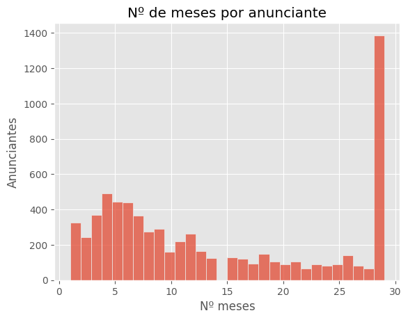
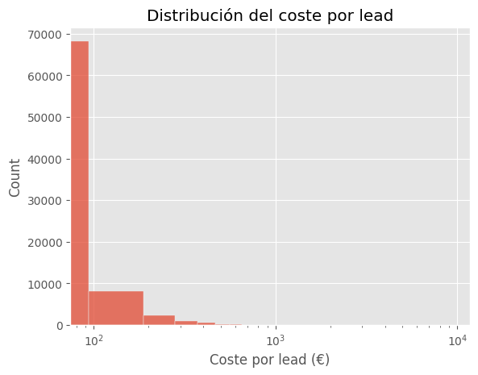
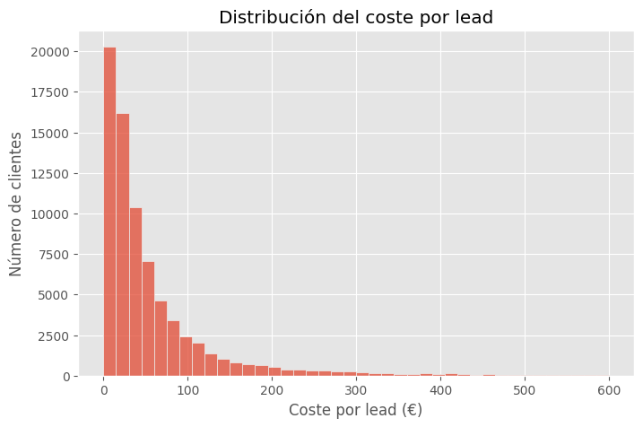

```python
import pandas as pd
import os
from pathlib import Path
import numpy as np 
import matplotlib.pyplot as plt
import seaborn as sns

plt.style.use("ggplot")
```


```python
os.getcwd()
```


    '/home/jterryc/KOMOREBI-PROJECT/src'


```python
os.listdir(".")
```


    ['src.txt', 'EDA.ipynb']


```python
wd_local_path = '../data/zrive_advertiser_df_wd.parquet'
dim_local_path = '../data/zrive_dim_advertiser.parquet'
fct_local_path = '../data/zrive_fct_monthly_df_fct_advertiser.parquet'
```


```python
df_wd = pd.read_parquet(wd_local_path, engine='fastparquet')
df_dim = pd.read_parquet(dim_local_path, engine='fastparquet')
df_fct = pd.read_parquet(fct_local_path, engine='fastparquet')
```

<h4>1. Información General de los datos (DF_DIM)<h4>

><h4> 1.1 Análisis del df</h4>


```python
print(f"Forma: {df_dim.shape}")
print(f"\nColumnas:")
print(df_dim.columns.tolist())
print(f"\nTipos de datos:")
print(df_dim.dtypes)
```

    Forma: (7076, 8)
    
    Columnas:
    ['advertiser_zrive_id', 'province_id', 'updated_at', 'advertiser_province', 'advertiser_group_id', 'min_start_contrato_date', 'max_start_contrato_nuevo_date', 'contrato_churn_date']
    
    Tipos de datos:
    advertiser_zrive_id                       int64
    province_id                               int64
    updated_at                       datetime64[us]
    advertiser_province                      object
    advertiser_group_id                     float64
    min_start_contrato_date          datetime64[ns]
    max_start_contrato_nuevo_date    datetime64[ns]
    contrato_churn_date              datetime64[ns]
    dtype: object


```python
df_dim.head()
```


<div>
<style scoped>
    .dataframe tbody tr th:only-of-type {
        vertical-align: middle;
    }

    .dataframe tbody tr th {
        vertical-align: top;
    }

    .dataframe thead th {
        text-align: right;
    }
</style>
<table border="1" class="dataframe">
  <thead>
    <tr style="text-align: right;">
      <th></th>
      <th>advertiser_zrive_id</th>
      <th>province_id</th>
      <th>updated_at</th>
      <th>advertiser_province</th>
      <th>advertiser_group_id</th>
      <th>min_start_contrato_date</th>
      <th>max_start_contrato_nuevo_date</th>
      <th>contrato_churn_date</th>
    </tr>
  </thead>
  <tbody>
    <tr>
      <th>0</th>
      <td>986</td>
      <td>1</td>
      <td>2025-05-01 02:46:04</td>
      <td>Álava</td>
      <td>194.0</td>
      <td>2025-01-07</td>
      <td>2025-01-07</td>
      <td>2025-05-17</td>
    </tr>
    <tr>
      <th>1</th>
      <td>6811</td>
      <td>1</td>
      <td>2025-02-05 01:02:08</td>
      <td>Álava</td>
      <td>NaN</td>
      <td>2025-01-24</td>
      <td>NaT</td>
      <td>2025-02-04</td>
    </tr>
    <tr>
      <th>2</th>
      <td>4890</td>
      <td>2</td>
      <td>2024-08-09 13:38:43</td>
      <td>Albacete</td>
      <td>133.0</td>
      <td>2023-02-24</td>
      <td>NaT</td>
      <td>2023-06-03</td>
    </tr>
    <tr>
      <th>3</th>
      <td>3428</td>
      <td>3</td>
      <td>2023-11-02 13:51:07</td>
      <td>Alicante</td>
      <td>NaN</td>
      <td>2023-03-17</td>
      <td>2023-03-17</td>
      <td>2023-11-01</td>
    </tr>
    <tr>
      <th>4</th>
      <td>547</td>
      <td>3</td>
      <td>2024-02-05 13:49:02</td>
      <td>Alicante</td>
      <td>NaN</td>
      <td>2023-05-03</td>
      <td>NaT</td>
      <td>2023-12-29</td>
    </tr>
  </tbody>
</table>
</div>


```python
df_dim["updated_at"].max()
```


    Timestamp('2025-06-19 18:36:05')


```python
df_dim["advertiser_zrive_id"].is_unique
```


    True


En **df_dim**, tenemos 1 fila = 1 advertiser

><h4> 1.2 Análisis por provincia</h4>


```python
#Sumauto aplica descuentos por provincias porque no todas generan el mismo tráfico
advertiser_province_unique = df_dim["advertiser_province"].unique()
print(f"Provincias unicas:  {advertiser_province_unique}")

advertiser_province_nunique = df_dim["advertiser_province"].nunique()
print(f"Num Provincias unicas: {advertiser_province_nunique}")
```

    Provincias unicas:  ['Álava' 'Albacete' 'Alicante' 'Asturias' 'Badajoz' 'Barcelona' 'Burgos'
     'Cáceres' 'Cantabria' 'Castellón' 'Córdoba' 'La Coruña' 'Girona'
     'Granada' 'Guadalajara' 'Huesca' 'Islas Baleares' 'Jaén' 'Lugo' 'Madrid'
     'Málaga' 'Murcia' 'Navarra' 'Pontevedra' 'La Rioja' 'Segovia' 'Sevilla'
     'Teruel' 'Toledo' 'Valencia' 'Valladolid' 'Vizcaya' 'Zaragoza' 'Almería'
     'Ávila' 'Cádiz' 'Ciudad Real' 'Cuenca' 'Guipúzcoa' 'Huelva' 'León'
     'Lleida' 'Orense' 'Palencia' 'Las Palmas' 'Salamanca' 'Soria' 'Tarragona'
     'Tenerife' 'Zamora' 'Ceuta' 'Melilla']
    Num Provincias unicas: 52


```python
#top 15 provincias
top_provinces = df_dim['advertiser_province'].value_counts().head(15)
print(top_provinces)

#Porcentaje acumulado (Top5)
total_clients = len(df_dim)
top5= (top_provinces.head(5).sum() / total_clients)*100
print(f"Top 5 provincias concentran {top5:.2f}% de los cientes")
```

    advertiser_province
    Madrid       1198
    Barcelona     789
    Valencia      439
    Málaga        374
    Alicante      361
    Sevilla       342
    Murcia        257
    Asturias      173
    Toledo        162
    Vizcaya       161
    La Coruña     149
    Tarragona     147
    Granada       141
    Córdoba       133
    Zaragoza      120
    Name: count, dtype: int64
    Top 5 provincias concentran 44.67% de los cientes


- Concentración geográfica muy alta. Top 5 provincias concentran 44.67% de los cientes (la mayoría del negocio está en grandes ciudades)
- No tendría sentido comparar directamente un cliente de Madrid o Barcelona con uno de Soria. 

><h4> 1.3 Análisis por grupos (concesionarios)</h4>


```python
#Grupo de concesionarios (adv_group_id)
clients_in_group = df_dim['advertiser_group_id'].notna().sum()
pct_in_group = (clients_in_group / len(df_dim)) * 100

print(f"Clientes que pertenecen a un grupo: {clients_in_group} ({pct_in_group:.2f}%)")
print(f"Clientes independientes: {df_dim['advertiser_group_id'].isna().sum()}")

n_groups = df_dim['advertiser_group_id'].nunique()
print(f"Grupos únicos: {n_groups}")

# Tamaño promedio de los grupos
group_sizes = df_dim.groupby('advertiser_group_id').size()
print("Distribución del tamaño de grupos:")
print(group_sizes.describe())
print()
print("Top 10 grupos más grandes:")
print(group_sizes.sort_values(ascending=False).head(10))

advertiser_groups = (
    df_dim
    .groupby("advertiser_group_id")["advertiser_zrive_id"]
    .nunique()
    .sort_values(ascending=False)
    .head(10)
)

sns.barplot(
    x=advertiser_groups.values,
    y=advertiser_groups.index,
    order=advertiser_groups.index,
    orient = "h"
)
plt.title("Top 10 grupos más grandes")
plt.show()
```

    Clientes que pertenecen a un grupo: 1323 (18.70%)
    Clientes independientes: 5753
    Grupos únicos: 112
    Distribución del tamaño de grupos:
    count    112.000000
    mean      11.812500
    std       31.438924
    min        1.000000
    25%        2.000000
    50%        4.000000
    75%       11.000000
    max      257.000000
    dtype: float64
    
    Top 10 grupos más grandes:
    advertiser_group_id
    125.0    257
    55.0     195
    48.0      78
    117.0     69
    100.0     49
    41.0      29
    68.0      22
    58.0      22
    132.0     22
    154.0     22
    dtype: int64


    

    


```python
# 1. Investigar grupo 125
top_group = df_dim[df_dim['advertiser_group_id'] == 125.0]
print(f"Provincias únicas del grupo 125: {top_group['advertiser_province'].nunique()}")
print("\nTop 10 provincias del grupo 125:")
print(top_group['advertiser_province'].value_counts().head(10))
```

    Provincias únicas del grupo 125: 43
    
    Top 10 provincias del grupo 125:
    advertiser_province
    Madrid       40
    Barcelona    37
    Alicante     13
    Málaga       12
    Vizcaya      11
    Sevilla      10
    Valencia      9
    Granada       7
    Toledo        6
    Murcia        6
    Name: count, dtype: int64


```python
top10 = (
    top_group["advertiser_province"]
    .value_counts()
    .head(10)
)

sns.barplot(
    x=top10.values,
    y=top10.index,
    orient = "h"
)
plt.show()

```


    

    


- Solo el 18,70% de los clientes pertenece a un grupo, mientras que el resto son independientes.
- La mayoria de los grupos son pequeños (P50 = 4 clientes)
- El grupo más grande (125) es nacional, opera en 43 provincias de 52 provincias totales y además fuerte concentración en ciudades grandes (coincide que es donde más trafico de clientes hay)

><h4>1.4 Permanencia Clientes<h4>

Analizamos los datos temporales en **df_fct**, que es la información sobre la actividad de los df_dim en el periodo de estudio (2023-2025)


```python
df_months = (
    df_fct
    .groupby("advertiser_zrive_id")["period_int"]
    .nunique()
    .reset_index()
    .rename(columns={"period_int":"n_months"})
)

print(df_months["n_months"].describe())
```

    count    6968.000000
    mean       13.896240
    std         9.970446
    min         1.000000
    25%         5.000000
    50%        11.000000
    75%        25.000000
    max        29.000000
    Name: n_months, dtype: float64


```python
sns.histplot(df_months, x="n_months", bins=30)

plt.title("Nº de meses por anunciante")
plt.xlabel("Nº meses")
plt.ylabel("Anunciantes")
```


    Text(0, 0.5, 'Anunciantes')


    

    


Distribución bimodal; podemos comprobar que los df_dim se concentran en dos grupos principales:
- Corto-medio plazo (5 meses aprox.)
- Largo plazo (29 meses aprox.)

<h4>2. Información General de los datos (DF_WITHDRAWAL)<h4>


```python
df_wd.info()
```

    <class 'pandas.core.frame.DataFrame'>
    RangeIndex: 22668 entries, 0 to 22667
    Data columns (total 7 columns):
     #   Column                     Non-Null Count  Dtype         
    ---  ------                     --------------  -----         
     0   withdrawal_id              22668 non-null  int64         
     1   advertiser_zrive_id        22668 non-null  int64         
     2   withdrawal_status          22668 non-null  object        
     3   withdrawal_type            22668 non-null  object        
     4   withdrawal_creation_date   22668 non-null  datetime64[us]
     5   withdrawal_effective_date  14348 non-null  datetime64[ns]
     6   withdrawal_reason          22668 non-null  object        
    dtypes: datetime64[ns](1), datetime64[us](1), int64(2), object(3)
    memory usage: 1.2+ MB


```python
df_wd.isna().sum()
```


    withdrawal_id                   0
    advertiser_zrive_id             0
    withdrawal_status               0
    withdrawal_type                 0
    withdrawal_creation_date        0
    withdrawal_effective_date    8320
    withdrawal_reason               0
    dtype: int64


```python
print(f"Forma: {df_wd.shape}")
print(f"\nColumnas:")
print(df_wd.columns.tolist())
print(f"\nTipos de datos:")
print(df_wd.dtypes)
```

    Forma: (22668, 7)
    
    Columnas:
    ['withdrawal_id', 'advertiser_zrive_id', 'withdrawal_status', 'withdrawal_type', 'withdrawal_creation_date', 'withdrawal_effective_date', 'withdrawal_reason']
    
    Tipos de datos:
    withdrawal_id                         int64
    advertiser_zrive_id                   int64
    withdrawal_status                    object
    withdrawal_type                      object
    withdrawal_creation_date     datetime64[us]
    withdrawal_effective_date    datetime64[ns]
    withdrawal_reason                    object
    dtype: object


```python
df_wd['withdrawal_effective_date'] = pd.to_datetime(df_wd['withdrawal_effective_date'])
df_wd.head(10)
```


<div>
<style scoped>
    .dataframe tbody tr th:only-of-type {
        vertical-align: middle;
    }

    .dataframe tbody tr th {
        vertical-align: top;
    }

    .dataframe thead th {
        text-align: right;
    }
</style>
<table border="1" class="dataframe">
  <thead>
    <tr style="text-align: right;">
      <th></th>
      <th>withdrawal_id</th>
      <th>advertiser_zrive_id</th>
      <th>withdrawal_status</th>
      <th>withdrawal_type</th>
      <th>withdrawal_creation_date</th>
      <th>withdrawal_effective_date</th>
      <th>withdrawal_reason</th>
    </tr>
  </thead>
  <tbody>
    <tr>
      <th>0</th>
      <td>0</td>
      <td>259</td>
      <td>Cerrada</td>
      <td>TOTAL</td>
      <td>2012-06-19 07:12:34</td>
      <td>2012-07-01</td>
      <td>RESULTADOS</td>
    </tr>
    <tr>
      <th>1</th>
      <td>1</td>
      <td>221</td>
      <td>Cerrada</td>
      <td>TOTAL</td>
      <td>2012-06-19 07:16:34</td>
      <td>NaT</td>
      <td>RESULTADOS</td>
    </tr>
    <tr>
      <th>2</th>
      <td>7</td>
      <td>492</td>
      <td>Cerrada</td>
      <td>TOTAL</td>
      <td>2012-06-20 07:10:16</td>
      <td>2012-07-01</td>
      <td>RESULTADOS</td>
    </tr>
    <tr>
      <th>3</th>
      <td>12</td>
      <td>481</td>
      <td>Cerrada</td>
      <td>TOTAL</td>
      <td>2012-06-20 11:59:36</td>
      <td>2012-07-01</td>
      <td>RESULTADOS</td>
    </tr>
    <tr>
      <th>4</th>
      <td>16</td>
      <td>457</td>
      <td>Cerrada</td>
      <td>TOTAL</td>
      <td>2012-06-20 15:41:39</td>
      <td>2012-07-01</td>
      <td>FALTA DE USO/TIEMPO</td>
    </tr>
    <tr>
      <th>5</th>
      <td>36</td>
      <td>95</td>
      <td>Cerrada</td>
      <td>TOTAL</td>
      <td>2012-06-22 10:40:37</td>
      <td>2012-07-01</td>
      <td>RAZONES ECONOMICAS</td>
    </tr>
    <tr>
      <th>6</th>
      <td>49</td>
      <td>620</td>
      <td>Cerrada</td>
      <td>TOTAL</td>
      <td>2012-06-26 15:53:04</td>
      <td>NaT</td>
      <td>RAZONES ECONOMICAS</td>
    </tr>
    <tr>
      <th>7</th>
      <td>53</td>
      <td>443</td>
      <td>Cerrada</td>
      <td>TOTAL</td>
      <td>2012-06-27 08:00:09</td>
      <td>NaT</td>
      <td>RESULTADOS</td>
    </tr>
    <tr>
      <th>8</th>
      <td>57</td>
      <td>675</td>
      <td>Cerrada</td>
      <td>TOTAL</td>
      <td>2012-06-27 10:55:17</td>
      <td>2012-07-01</td>
      <td>RESULTADOS</td>
    </tr>
    <tr>
      <th>9</th>
      <td>58</td>
      <td>195</td>
      <td>Cerrada</td>
      <td>TOTAL</td>
      <td>2012-06-27 11:19:15</td>
      <td>2012-07-01</td>
      <td>RESULTADOS</td>
    </tr>
  </tbody>
</table>
</div>


><h4>2.1 Análisis de Razones de Baja<h4>

Se consideran bajas definitivas aquellas donde: 
1. withdrawal_type = 'TOTAL' 
2. withdrawal_status != 'Denegada' 
3. withdrawal_reason not in ('Upselling-cambio de contrato', 'Cambio a Bundle Online', 
'Cambio de Contrato/propuesta/producto')


```python
withdrawal_reason_not = ['Upselling-cambio de contrato', 'Cambio a Bundle Online','Cambio de Contrato/propuesta/producto']
withdrawal_reason_yes = set(df_wd.withdrawal_reason.values).difference(set(withdrawal_reason_not))
withdrawal_reason_yes
```


    {'Baja Bundle AS24',
     'CESE DE ACTIVIDAD',
     'CORONAVIRUS',
     'Desconocido',
     'FALTA DE PRODUCTO',
     'FALTA DE USO/TIEMPO',
     'FIN DE CONTRATO',
     'Incidencias de la web',
     'MOROSIDAD',
     'No acepta subida',
     'OTROS',
     'RATIO RESULTADO-INVERSION',
     'RAZONES ECONOMICAS',
     'RESULTADOS',
     'Reestructuración cuentas de grupo'}


```python
# Creamos nueva columna binaria para definir las filas con withdrawal definitivo
df_wd["is_definitive_withdrawal"] = (
    df_wd.withdrawal_reason.isin(withdrawal_reason_yes) &
    (df_wd.withdrawal_type == "TOTAL") &
    (df_wd.withdrawal_status != "Denegada")
).astype(int)
df_wd
```


<div>
<style scoped>
    .dataframe tbody tr th:only-of-type {
        vertical-align: middle;
    }

    .dataframe tbody tr th {
        vertical-align: top;
    }

    .dataframe thead th {
        text-align: right;
    }
</style>
<table border="1" class="dataframe">
  <thead>
    <tr style="text-align: right;">
      <th></th>
      <th>withdrawal_id</th>
      <th>advertiser_zrive_id</th>
      <th>withdrawal_status</th>
      <th>withdrawal_type</th>
      <th>withdrawal_creation_date</th>
      <th>withdrawal_effective_date</th>
      <th>withdrawal_reason</th>
      <th>is_definitive_withdrawal</th>
    </tr>
  </thead>
  <tbody>
    <tr>
      <th>0</th>
      <td>0</td>
      <td>259</td>
      <td>Cerrada</td>
      <td>TOTAL</td>
      <td>2012-06-19 07:12:34</td>
      <td>2012-07-01</td>
      <td>RESULTADOS</td>
      <td>1</td>
    </tr>
    <tr>
      <th>1</th>
      <td>1</td>
      <td>221</td>
      <td>Cerrada</td>
      <td>TOTAL</td>
      <td>2012-06-19 07:16:34</td>
      <td>NaT</td>
      <td>RESULTADOS</td>
      <td>1</td>
    </tr>
    <tr>
      <th>2</th>
      <td>7</td>
      <td>492</td>
      <td>Cerrada</td>
      <td>TOTAL</td>
      <td>2012-06-20 07:10:16</td>
      <td>2012-07-01</td>
      <td>RESULTADOS</td>
      <td>1</td>
    </tr>
    <tr>
      <th>3</th>
      <td>12</td>
      <td>481</td>
      <td>Cerrada</td>
      <td>TOTAL</td>
      <td>2012-06-20 11:59:36</td>
      <td>2012-07-01</td>
      <td>RESULTADOS</td>
      <td>1</td>
    </tr>
    <tr>
      <th>4</th>
      <td>16</td>
      <td>457</td>
      <td>Cerrada</td>
      <td>TOTAL</td>
      <td>2012-06-20 15:41:39</td>
      <td>2012-07-01</td>
      <td>FALTA DE USO/TIEMPO</td>
      <td>1</td>
    </tr>
    <tr>
      <th>...</th>
      <td>...</td>
      <td>...</td>
      <td>...</td>
      <td>...</td>
      <td>...</td>
      <td>...</td>
      <td>...</td>
      <td>...</td>
    </tr>
    <tr>
      <th>22663</th>
      <td>55613</td>
      <td>684</td>
      <td>Cerrada</td>
      <td>TOTAL</td>
      <td>2025-05-30 10:57:08</td>
      <td>2025-08-01</td>
      <td>RATIO RESULTADO-INVERSION</td>
      <td>1</td>
    </tr>
    <tr>
      <th>22664</th>
      <td>55614</td>
      <td>251</td>
      <td>Cerrada</td>
      <td>TOTAL</td>
      <td>2025-05-30 10:58:12</td>
      <td>2025-08-01</td>
      <td>RATIO RESULTADO-INVERSION</td>
      <td>1</td>
    </tr>
    <tr>
      <th>22665</th>
      <td>55615</td>
      <td>80</td>
      <td>Cerrada</td>
      <td>TOTAL</td>
      <td>2025-05-30 10:59:03</td>
      <td>2025-08-01</td>
      <td>RATIO RESULTADO-INVERSION</td>
      <td>1</td>
    </tr>
    <tr>
      <th>22666</th>
      <td>55616</td>
      <td>5149</td>
      <td>Cerrada</td>
      <td>TOTAL</td>
      <td>2025-05-30 11:15:01</td>
      <td>2025-07-01</td>
      <td>MOROSIDAD</td>
      <td>1</td>
    </tr>
    <tr>
      <th>22667</th>
      <td>55617</td>
      <td>1634</td>
      <td>Cerrada</td>
      <td>TOTAL</td>
      <td>2025-05-30 11:29:06</td>
      <td>NaT</td>
      <td>MOROSIDAD</td>
      <td>1</td>
    </tr>
  </tbody>
</table>
<p>22668 rows × 8 columns</p>
</div>


```python
df_wd["advertiser_zrive_id"].value_counts()
```


    advertiser_zrive_id
    122     58
    2915    47
    1378    44
    953     36
    56      35
            ..
    6927     1
    6294     1
    6409     1
    6825     1
    6922     1
    Name: count, Length: 6021, dtype: int64


```python
#Top 15 razones de baja (%)
reason_dist = (
    df_wd
    .loc[df_wd.is_definitive_withdrawal == 1, "withdrawal_reason"]
    .value_counts(normalize=True)
    .head(15)
) *100
print(round(reason_dist, 2))

```

    withdrawal_reason
    RESULTADOS                           36.14
    MOROSIDAD                            19.94
    RAZONES ECONOMICAS                   14.06
    RATIO RESULTADO-INVERSION            10.16
    FALTA DE USO/TIEMPO                   5.34
    OTROS                                 4.50
    FALTA DE PRODUCTO                     3.59
    CESE DE ACTIVIDAD                     2.86
    Reestructuración cuentas de grupo     1.15
    FIN DE CONTRATO                       0.90
    CORONAVIRUS                           0.63
    No acepta subida                      0.32
    Desconocido                           0.23
    Incidencias de la web                 0.13
    Baja Bundle AS24                      0.04
    Name: proportion, dtype: float64


>La principal causa de baja está relacionada con los resultados, junto con razones economicas y morosidad suma mas del 60%, lo que indica que el churn está muy relacionado con la retorno del servicio

<h4>3. Información General de los datos (DF_FCT)<h4>


```python
df_fct.info()
```

    <class 'pandas.core.frame.DataFrame'>
    RangeIndex: 96829 entries, 0 to 96828
    Data columns (total 23 columns):
     #   Column                         Non-Null Count  Dtype  
    ---  ------                         --------------  -----  
     0   advertiser_zrive_id            96829 non-null  int64  
     1   period_int                     96829 non-null  int64  
     2   monthly_contracted_ads         96829 non-null  int64  
     3   monthly_published_ads          96829 non-null  int64  
     4   monthly_unique_published_ads   96829 non-null  int64  
     5   monthly_distinct_ads           86777 non-null  float64
     6   monthly_oro_ads                96829 non-null  int64  
     7   monthly_plata_ads              96829 non-null  int64  
     8   monthly_destacados_ads         96829 non-null  int64  
     9   monthly_pepitas_ads            96829 non-null  int64  
     10  monthly_shows                  96829 non-null  float64
     11  monthly_visits                 96829 non-null  float64
     12  monthly_leads                  96829 non-null  int64  
     13  monthly_total_phone_views      96829 non-null  int64  
     14  monthly_total_calls            96829 non-null  int64  
     15  monthly_total_emails           96829 non-null  int64  
     16  monthly_total_invoice          96829 non-null  float64
     17  monthly_total_reference_price  84499 non-null  float64
     18  monthly_unique_calls           96829 non-null  int64  
     19  monthly_unique_emails          96829 non-null  int64  
     20  monthly_unique_leads           96829 non-null  int64  
     21  monthly_avg_ad_price           88362 non-null  float64
     22  has_active_contract            96829 non-null  bool   
    dtypes: bool(1), float64(6), int64(16)
    memory usage: 16.3 MB


```python
df_fct[["advertiser_zrive_id", "period_int"]].duplicated().any()
```


    np.False_


Tabla **df_fct**: 1 fila = 1 mes


```python
print(f"Forma: {df_fct.shape}")
print(f"\nColumnas:")
print(df_fct.columns.tolist())

```

    Forma: (96829, 23)
    
    Columnas:
    ['advertiser_zrive_id', 'period_int', 'monthly_contracted_ads', 'monthly_published_ads', 'monthly_unique_published_ads', 'monthly_distinct_ads', 'monthly_oro_ads', 'monthly_plata_ads', 'monthly_destacados_ads', 'monthly_pepitas_ads', 'monthly_shows', 'monthly_visits', 'monthly_leads', 'monthly_total_phone_views', 'monthly_total_calls', 'monthly_total_emails', 'monthly_total_invoice', 'monthly_total_reference_price', 'monthly_unique_calls', 'monthly_unique_emails', 'monthly_unique_leads', 'monthly_avg_ad_price', 'has_active_contract']


```python
# Convertimos la columna "period_int" a YYYY-MM-DD
try:
    df_fct["period_int"] = pd.to_datetime(df_fct['period_int'].astype(str), format="%Y%m")
except ValueError:
    pass
df_fct.head()
```


<div>
<style scoped>
    .dataframe tbody tr th:only-of-type {
        vertical-align: middle;
    }

    .dataframe tbody tr th {
        vertical-align: top;
    }

    .dataframe thead th {
        text-align: right;
    }
</style>
<table border="1" class="dataframe">
  <thead>
    <tr style="text-align: right;">
      <th></th>
      <th>advertiser_zrive_id</th>
      <th>period_int</th>
      <th>monthly_contracted_ads</th>
      <th>monthly_published_ads</th>
      <th>monthly_unique_published_ads</th>
      <th>monthly_distinct_ads</th>
      <th>monthly_oro_ads</th>
      <th>monthly_plata_ads</th>
      <th>monthly_destacados_ads</th>
      <th>monthly_pepitas_ads</th>
      <th>...</th>
      <th>monthly_total_phone_views</th>
      <th>monthly_total_calls</th>
      <th>monthly_total_emails</th>
      <th>monthly_total_invoice</th>
      <th>monthly_total_reference_price</th>
      <th>monthly_unique_calls</th>
      <th>monthly_unique_emails</th>
      <th>monthly_unique_leads</th>
      <th>monthly_avg_ad_price</th>
      <th>has_active_contract</th>
    </tr>
  </thead>
  <tbody>
    <tr>
      <th>0</th>
      <td>1</td>
      <td>2023-01-01</td>
      <td>75</td>
      <td>47</td>
      <td>47</td>
      <td>56.0</td>
      <td>6</td>
      <td>6</td>
      <td>6</td>
      <td>0</td>
      <td>...</td>
      <td>14</td>
      <td>15</td>
      <td>0</td>
      <td>1714.2</td>
      <td>2416.7</td>
      <td>12</td>
      <td>3</td>
      <td>15</td>
      <td>42667.86</td>
      <td>True</td>
    </tr>
    <tr>
      <th>1</th>
      <td>2</td>
      <td>2023-01-01</td>
      <td>150</td>
      <td>31</td>
      <td>31</td>
      <td>55.0</td>
      <td>10</td>
      <td>10</td>
      <td>4</td>
      <td>0</td>
      <td>...</td>
      <td>16</td>
      <td>2</td>
      <td>2</td>
      <td>293.3</td>
      <td>3643.3</td>
      <td>2</td>
      <td>2</td>
      <td>4</td>
      <td>22742.40</td>
      <td>True</td>
    </tr>
    <tr>
      <th>2</th>
      <td>3</td>
      <td>2023-01-01</td>
      <td>0</td>
      <td>0</td>
      <td>0</td>
      <td>NaN</td>
      <td>0</td>
      <td>0</td>
      <td>0</td>
      <td>0</td>
      <td>...</td>
      <td>0</td>
      <td>0</td>
      <td>0</td>
      <td>0.0</td>
      <td>NaN</td>
      <td>0</td>
      <td>0</td>
      <td>0</td>
      <td>25420.83</td>
      <td>False</td>
    </tr>
    <tr>
      <th>3</th>
      <td>4</td>
      <td>2023-01-01</td>
      <td>85</td>
      <td>79</td>
      <td>79</td>
      <td>86.0</td>
      <td>3</td>
      <td>3</td>
      <td>1</td>
      <td>0</td>
      <td>...</td>
      <td>10</td>
      <td>8</td>
      <td>2</td>
      <td>1165.0</td>
      <td>3023.3</td>
      <td>6</td>
      <td>6</td>
      <td>12</td>
      <td>23259.52</td>
      <td>True</td>
    </tr>
    <tr>
      <th>4</th>
      <td>6</td>
      <td>2023-01-01</td>
      <td>20</td>
      <td>20</td>
      <td>20</td>
      <td>25.0</td>
      <td>0</td>
      <td>0</td>
      <td>1</td>
      <td>0</td>
      <td>...</td>
      <td>10</td>
      <td>4</td>
      <td>3</td>
      <td>336.3</td>
      <td>515.0</td>
      <td>4</td>
      <td>11</td>
      <td>15</td>
      <td>43439.00</td>
      <td>True</td>
    </tr>
  </tbody>
</table>
<p>5 rows × 23 columns</p>
</div>


```python
df_fct[df_fct["monthly_total_invoice"] == -1833.3]
```


<div>
<style scoped>
    .dataframe tbody tr th:only-of-type {
        vertical-align: middle;
    }

    .dataframe tbody tr th {
        vertical-align: top;
    }

    .dataframe thead th {
        text-align: right;
    }
</style>
<table border="1" class="dataframe">
  <thead>
    <tr style="text-align: right;">
      <th></th>
      <th>advertiser_zrive_id</th>
      <th>period_int</th>
      <th>monthly_contracted_ads</th>
      <th>monthly_published_ads</th>
      <th>monthly_unique_published_ads</th>
      <th>monthly_distinct_ads</th>
      <th>monthly_oro_ads</th>
      <th>monthly_plata_ads</th>
      <th>monthly_destacados_ads</th>
      <th>monthly_pepitas_ads</th>
      <th>...</th>
      <th>monthly_total_phone_views</th>
      <th>monthly_total_calls</th>
      <th>monthly_total_emails</th>
      <th>monthly_total_invoice</th>
      <th>monthly_total_reference_price</th>
      <th>monthly_unique_calls</th>
      <th>monthly_unique_emails</th>
      <th>monthly_unique_leads</th>
      <th>monthly_avg_ad_price</th>
      <th>has_active_contract</th>
    </tr>
  </thead>
  <tbody>
  </tbody>
</table>
<p>0 rows × 23 columns</p>
</div>


>Aparece un valor negativo en monthly_total_invoice (-1.833€). Al ser casos muy concretos y no representar el comportamiento normal de facturación, tiene sentido excluirlos del análisis para no distorsionar la distribución.


```python
df_fct = df_fct[df_fct["monthly_total_invoice"] >= 0].copy()
```

>Para el análisis de pricing solo se tienen en cuenta los meses con contrato activo (has_active_contract = True).
Los meses sin contrato tienen facturación 0 y precios de referencia nulos, por lo que no aportan información útil sobre el valor real del cliente y distorsionan las métricas.


```python
# Miramos si hay usuarios con has_active_contract = 0 en el periodo de estudio (2023 - 2025)
(
    df_fct
    .groupby("advertiser_zrive_id")["has_active_contract"]
    .sum()
    .loc[lambda x: x==0]
)
```


    advertiser_zrive_id
    7036    0
    7066    0
    7069    0
    Name: has_active_contract, dtype: int64


```python
main_variables = ['monthly_total_invoice', 'monthly_contracted_ads', 
                   'monthly_published_ads', 'monthly_shows', 'monthly_visits', 'monthly_leads']

```


```python
plt.figure()
plt.boxplot(df_fct["monthly_total_invoice"], vert = False, showfliers= False)
plt.xlabel("Monthly total invoice")
plt.ylabel("Distribution of monthly total invoice")
plt.show()
```


    

    


```python
df_fct["price_bucket"] = pd.cut(
    df_fct["monthly_total_invoice"],
    bins=[0, 100, 250, 500, 1000, 5000, 40000],
    labels=["<100", "100-250", "250-500", "500-1k", "1k-5k", "5k+"]
)

df_fct["price_bucket"].value_counts(normalize=True).sort_index()
```


    price_bucket
    <100       0.231605
    100-250    0.241092
    250-500    0.233906
    500-1k     0.168397
    1k-5k      0.112941
    5k+        0.012059
    Name: proportion, dtype: float64


```python
df_fct["price_diff_pct"] = (
    df_fct["monthly_total_invoice"]
    / df_fct["monthly_total_reference_price"]
) - 1
df_fct["price_diff_pct"].describe()

```


    count    84498.000000
    mean        -0.483692
    std          0.677025
    min         -1.000000
    25%         -0.702794
    50%         -0.500000
    75%         -0.229515
    max        125.640769
    Name: price_diff_pct, dtype: float64


- La mayor parte de los clientes se concentra en un rango de precio mensual bajo: cerca del 70% paga menos de 500€, con un peso muy relevante entre 100–250€ y 250–500€. 
- Al comprarar el precio de tarifa frente a la facturación mensual, los clientes pagan significativamente menos del precio de tarifa (-50%), esto significa que el precio tarifa está mal planteado


```python
df_fct["monthly_contracted_ads"].quantile(0.95)
```


    np.float64(300.0)


```python
df_fct["monthly_contracted_ads"].describe(percentiles=[0.95])
```


    count    96827.000000
    mean       108.101191
    std        490.209838
    min          0.000000
    50%         20.000000
    95%        300.000000
    max       8200.000000
    Name: monthly_contracted_ads, dtype: float64


```python
p95 = df_fct["monthly_contracted_ads"].quantile(0.95)

sns.histplot(
    df_fct[df_fct['monthly_contracted_ads'] <= p95]['monthly_contracted_ads'],
    bins=30
)

plt.axvline(p95, color='red', linestyle='--', label='P95')
plt.legend()
plt.title("Distribución de anuncios contratados (hasta P95)")
plt.show()
```


    

    


- Distribución del tamaño de los clientes según nº de meses contratados. Para visualizarlo mejor, se muestra el percentil 95 ya que la distribución tiene cola larga hacia la derecha: muchos anunciantes con pocos anuncios y pocos anunciantes con muchísimos anuncios
- La mitad tiene contratados 20 anuncios o menos


```python
# Clientes únicos
print(f"Clientes únicos: {df_fct['advertiser_zrive_id'].nunique():}")
#media de clientes por meses
clientes_por_mes = (
    df_fct
        .groupby("period_int")["advertiser_zrive_id"]
        .nunique()
)
print(f"Análisis de clientes por mes")
clientes_por_mes.describe()

```

    Clientes únicos: 6968
    Análisis de clientes por mes


    count      29.000000
    mean     3338.862069
    std       100.918186
    min      3144.000000
    25%      3258.000000
    50%      3346.000000
    75%      3413.000000
    max      3542.000000
    Name: advertiser_zrive_id, dtype: float64


- La mayoría de clientes son pequeños o medianos: lo normal es contratar unos 20 anuncios y publicar alrededor de 12.  
- Los datos están muy descompensados, con unos pocos clientes muy grandes que suben la media, por lo que los percentiles representan mejor la realidad que la media.  
- Aunque hay casi 7.000 clientes distintos en total, en un mes medio hay unos 3.300 activos, lo que muestra bastante rotación de clientes en el tiempo.  
- El recorrido de los anuncios es claro (se muestran, se visitan y luego generan leads), pero los leads no son muchos, así que el valor del servicio está más en el rendimiento que en el volumen.

><h4>Creación columnas nuevas<h4>


```python
# Lead Conversion Rate (% de visitas se convierten en leads)
df_fct["conversion_rate"] = np.where(
    df_fct["monthly_visits"] > 0,
    df_fct["monthly_leads"] / df_fct["monthly_visits"],
    np.nan
)

# Cost Per Lead (cuanto paga el cliente por cada lead generado)
df_fct["cost_per_lead"] = np.where(
    df_fct["monthly_leads"] > 0,
    df_fct["monthly_total_invoice"] / df_fct["monthly_leads"],
    np.nan
)

# Ratio de Uso (anuncios publicados vs contratados)
df_fct["usage_ratio"] = (df_fct["monthly_published_ads"]/df_fct["monthly_contracted_ads"].replace(0, np.nan))
```


```python
df_fct["usage_ratio"].describe()
```


    count    96484.000000
    mean         0.720402
    std          0.361695
    min          0.000000
    25%          0.500000
    50%          0.800000
    75%          1.000000
    max          3.700000
    Name: usage_ratio, dtype: float64


Distribución del ratio de uso: anuncios publicados frente a los contratados. Se comprueba que el un 25% de los df_dim tienen un ratio > 1. Como está a nivel user - mes, hacemos un groupby para ver la info a nivel usuario y ver el total de anuncios contratados y publicados


```python
df_usage_ratio = (
    df_fct
    .groupby("advertiser_zrive_id")[["monthly_contracted_ads", "monthly_unique_published_ads"]]
    .sum()
    .assign(
    usage_ratio=lambda x:
        x["monthly_unique_published_ads"] / x["monthly_contracted_ads"].replace(0, np.nan) 
    )
)
df_usage_ratio
```


<div>
<style scoped>
    .dataframe tbody tr th:only-of-type {
        vertical-align: middle;
    }

    .dataframe tbody tr th {
        vertical-align: top;
    }

    .dataframe thead th {
        text-align: right;
    }
</style>
<table border="1" class="dataframe">
  <thead>
    <tr style="text-align: right;">
      <th></th>
      <th>monthly_contracted_ads</th>
      <th>monthly_unique_published_ads</th>
      <th>usage_ratio</th>
    </tr>
    <tr>
      <th>advertiser_zrive_id</th>
      <th></th>
      <th></th>
      <th></th>
    </tr>
  </thead>
  <tbody>
    <tr>
      <th>1</th>
      <td>375</td>
      <td>169</td>
      <td>0.450667</td>
    </tr>
    <tr>
      <th>2</th>
      <td>4350</td>
      <td>1728</td>
      <td>0.397241</td>
    </tr>
    <tr>
      <th>3</th>
      <td>105</td>
      <td>51</td>
      <td>0.485714</td>
    </tr>
    <tr>
      <th>4</th>
      <td>2990</td>
      <td>3029</td>
      <td>1.013043</td>
    </tr>
    <tr>
      <th>5</th>
      <td>1075</td>
      <td>779</td>
      <td>0.724651</td>
    </tr>
    <tr>
      <th>...</th>
      <td>...</td>
      <td>...</td>
      <td>...</td>
    </tr>
    <tr>
      <th>7047</th>
      <td>3</td>
      <td>0</td>
      <td>0.000000</td>
    </tr>
    <tr>
      <th>7051</th>
      <td>20</td>
      <td>0</td>
      <td>0.000000</td>
    </tr>
    <tr>
      <th>7052</th>
      <td>3</td>
      <td>0</td>
      <td>0.000000</td>
    </tr>
    <tr>
      <th>7066</th>
      <td>90</td>
      <td>86</td>
      <td>0.955556</td>
    </tr>
    <tr>
      <th>7069</th>
      <td>20</td>
      <td>9</td>
      <td>0.450000</td>
    </tr>
  </tbody>
</table>
<p>6968 rows × 3 columns</p>
</div>


```python
df_usage_ratio["usage_ratio"].describe()
```


    count    6956.000000
    mean        0.642500
    std         0.325140
    min         0.000000
    25%         0.429151
    50%         0.709938
    75%         0.889720
    max         3.000000
    Name: usage_ratio, dtype: float64


Sigue habiendo usuarios que tienen más anuncios publicados que contratados, puede ser un error en los datos


```python
df_fct["conversion_rate"].describe(percentiles=[0.75])
```


    count    91430.000000
    mean         0.007997
    std          0.080387
    min          0.000000
    50%          0.003727
    75%          0.006829
    max         18.750000
    Name: conversion_rate, dtype: float64


Ratio de conversión: % de visitas que se convierten en leads
- Fuertemente sesgada hacia la derecha
- Algunos casos muestran ratio > 1, lo cual no tiene sentido


```python
sns.histplot(
    df_fct["cost_per_lead"], 
    bins = 100
)
plt.xscale("log")
plt.xlabel("Coste por lead (€)")
plt.title("Distribución del coste por lead")
plt.show()
```


    

    


>La distribución del coste por lead está muy sesgada a la derecha. Sin embargo, existe una cola larga de clientes con costes muy elevados, estos clientes están pagando mucho para generar pocos leads. El problema principal es pagar mucho por un rendimiento bajo


```python
len(set(df_fct.advertiser_zrive_id) - set(df_dim.advertiser_zrive_id))
```


    0


Todos los df_dim en **fct** están en **dim**


```python
df_master = df_fct.merge(
    df_dim,
    on="advertiser_zrive_id",
    how="left"
)
df_master.shape
```


    (96827, 35)


```python
df_master.head()
```


<div>
<style scoped>
    .dataframe tbody tr th:only-of-type {
        vertical-align: middle;
    }

    .dataframe tbody tr th {
        vertical-align: top;
    }

    .dataframe thead th {
        text-align: right;
    }
</style>
<table border="1" class="dataframe">
  <thead>
    <tr style="text-align: right;">
      <th></th>
      <th>advertiser_zrive_id</th>
      <th>period_int</th>
      <th>monthly_contracted_ads</th>
      <th>monthly_published_ads</th>
      <th>monthly_unique_published_ads</th>
      <th>monthly_distinct_ads</th>
      <th>monthly_oro_ads</th>
      <th>monthly_plata_ads</th>
      <th>monthly_destacados_ads</th>
      <th>monthly_pepitas_ads</th>
      <th>...</th>
      <th>conversion_rate</th>
      <th>cost_per_lead</th>
      <th>usage_ratio</th>
      <th>province_id</th>
      <th>updated_at</th>
      <th>advertiser_province</th>
      <th>advertiser_group_id</th>
      <th>min_start_contrato_date</th>
      <th>max_start_contrato_nuevo_date</th>
      <th>contrato_churn_date</th>
    </tr>
  </thead>
  <tbody>
    <tr>
      <th>0</th>
      <td>1</td>
      <td>2023-01-01</td>
      <td>75</td>
      <td>47</td>
      <td>47</td>
      <td>56.0</td>
      <td>6</td>
      <td>6</td>
      <td>6</td>
      <td>0</td>
      <td>...</td>
      <td>0.003962</td>
      <td>95.233333</td>
      <td>0.626667</td>
      <td>11</td>
      <td>2023-06-16 09:35:01</td>
      <td>Cádiz</td>
      <td>NaN</td>
      <td>2020-12-23</td>
      <td>NaT</td>
      <td>2023-05-31</td>
    </tr>
    <tr>
      <th>1</th>
      <td>2</td>
      <td>2023-01-01</td>
      <td>150</td>
      <td>31</td>
      <td>31</td>
      <td>55.0</td>
      <td>10</td>
      <td>10</td>
      <td>4</td>
      <td>0</td>
      <td>...</td>
      <td>0.002003</td>
      <td>73.325000</td>
      <td>0.206667</td>
      <td>11</td>
      <td>2023-11-06 16:01:14</td>
      <td>Cádiz</td>
      <td>100.0</td>
      <td>2020-09-25</td>
      <td>2020-09-25</td>
      <td>NaT</td>
    </tr>
    <tr>
      <th>2</th>
      <td>3</td>
      <td>2023-01-01</td>
      <td>0</td>
      <td>0</td>
      <td>0</td>
      <td>NaN</td>
      <td>0</td>
      <td>0</td>
      <td>0</td>
      <td>0</td>
      <td>...</td>
      <td>NaN</td>
      <td>NaN</td>
      <td>NaN</td>
      <td>8</td>
      <td>2024-08-07 13:37:09</td>
      <td>Barcelona</td>
      <td>41.0</td>
      <td>2024-05-06</td>
      <td>NaT</td>
      <td>2024-07-15</td>
    </tr>
    <tr>
      <th>3</th>
      <td>4</td>
      <td>2023-01-01</td>
      <td>85</td>
      <td>79</td>
      <td>79</td>
      <td>86.0</td>
      <td>3</td>
      <td>3</td>
      <td>1</td>
      <td>0</td>
      <td>...</td>
      <td>0.004640</td>
      <td>83.214286</td>
      <td>0.929412</td>
      <td>48</td>
      <td>2023-05-03 16:37:02</td>
      <td>Vizcaya</td>
      <td>NaN</td>
      <td>2022-09-30</td>
      <td>NaT</td>
      <td>NaT</td>
    </tr>
    <tr>
      <th>4</th>
      <td>6</td>
      <td>2023-01-01</td>
      <td>20</td>
      <td>20</td>
      <td>20</td>
      <td>25.0</td>
      <td>0</td>
      <td>0</td>
      <td>1</td>
      <td>0</td>
      <td>...</td>
      <td>0.001811</td>
      <td>21.018750</td>
      <td>1.000000</td>
      <td>48</td>
      <td>2025-03-12 13:48:02</td>
      <td>Vizcaya</td>
      <td>NaN</td>
      <td>2022-10-10</td>
      <td>NaT</td>
      <td>NaT</td>
    </tr>
  </tbody>
</table>
<p>5 rows × 35 columns</p>
</div>


```python
df_master.columns
```


    Index(['advertiser_zrive_id', 'period_int', 'monthly_contracted_ads',
           'monthly_published_ads', 'monthly_unique_published_ads',
           'monthly_distinct_ads', 'monthly_oro_ads', 'monthly_plata_ads',
           'monthly_destacados_ads', 'monthly_pepitas_ads', 'monthly_shows',
           'monthly_visits', 'monthly_leads', 'monthly_total_phone_views',
           'monthly_total_calls', 'monthly_total_emails', 'monthly_total_invoice',
           'monthly_total_reference_price', 'monthly_unique_calls',
           'monthly_unique_emails', 'monthly_unique_leads', 'monthly_avg_ad_price',
           'has_active_contract', 'price_bucket', 'price_diff_pct',
           'conversion_rate', 'cost_per_lead', 'usage_ratio', 'province_id',
           'updated_at', 'advertiser_province', 'advertiser_group_id',
           'min_start_contrato_date', 'max_start_contrato_nuevo_date',
           'contrato_churn_date'],
          dtype='object')


```python
province_stats = (
    df_master
        .groupby('advertiser_province')['monthly_total_invoice']
        .median()
        .sort_values(ascending=False)
        .head(10)
)

plt.figure(figsize=(10, 5))
sns.barplot(
    x=province_stats.values,
    y=province_stats.index
)

plt.title('Facturación mediana por provincia (Top 10)')
plt.xlabel('Facturación mensual (€)')
plt.ylabel('Provincia')
plt.tight_layout()
plt.show()
```


    

    


```python
df_cost_plot = df_fct[
    (df_fct["cost_per_lead"] > 0) &
    (df_fct["cost_per_lead"] <= 600)
]

plt.figure(figsize=(8,5))

sns.histplot(
    df_cost_plot["cost_per_lead"],
    bins=40
)

plt.xlabel("Coste por lead (€)")
plt.ylabel("Número de clientes")
plt.title("Distribución del coste por lead")
plt.show()
```


    

    


<h4>CONCLUSIÓN</h4>

- El churn se dispara después de los 3 meses, coincidiendo con el fin de la promoción inicial
- El 55% de clientes (3,894 de 7,076) han solicitado baja al menos una vez
- La causa principal por la que chacer churn es "VALOR PERCIBIDO INSUFICIENTE", no ven suficiente retorno de lo que pagan
- El precio de tarifa no es realista: casi nadie lo paga y la mayoría de clientes está por debajo de 500€/mes.
- Hay diferencias claras por provincia, así que no tiene sentido un precio único para todos.
- Las métricas clave que explican el churn y deben guiar el pricing son:
     - Coste por lead

     - Ratio de conversión

     - Ratio de uso

     - Provincia (valor del tráfico)

     - Antigüedad del cliente

- Data quality: tanto en ratio de conversión como ratio de uso hay valores > 1, lo cual no tiene sentido

## Rango de fechas

Comprobamos en qué fechas tenemos datos en cada tabla


```python
print("\n--- RANGO DE FECHAS ---")
print(f"df_dim  min_start_contrato_date: "
      f"{df_dim['min_start_contrato_date'].min()} "
      f"→ {df_dim['min_start_contrato_date'].max()}")
print(f"df_fct     period_int:              "
      f"{df_fct['period_int'].min()} "
      f"→ {df_fct['period_int'].max()}")
print(f"df_wd  withdrawal_creation_date: "
      f"{df_wd['withdrawal_creation_date'].min()} "
      f"→ {df_wd['withdrawal_creation_date'].max()}")
```

    
    --- RANGO DE FECHAS ---
    df_dim  min_start_contrato_date: 2009-10-16 00:00:00 → 2025-06-20 00:00:00
    df_fct     period_int:              2023-01-01 → 2025-05-01
    df_wd  withdrawal_creation_date: 2012-06-19 07:12:34 → 2025-05-30 11:29:06


- En las tablas dim y wd hay datos mucho anteriores al periodo de estudio, que comienza en 2023. Los datos que nos sobran serían aquellos de df_wd donde la fecha de baja definitiva (withdrawal_effective_date) es menor a 2023

## Análisis de bajas 

A continuación analizamos los usuarios cuyo has_active_contract pasa de 1 a 0 en el periodo de estudio, es decir, dejan de tener contrato activo


```python
df_fct_sorted = df_fct.sort_values(["advertiser_zrive_id", "period_int"])

df_fct_sorted["was_prev_active"] = (
    df_fct_sorted.groupby("advertiser_zrive_id")["has_active_contract"]
      .shift(1)
)

# Filtro: nos quedamos con los advertisers que han pasado de 1 a 0, es decir, que se dan de baja
changes_1_0 = df_fct_sorted[
    (df_fct_sorted["has_active_contract"] == 0) &
    (df_fct_sorted["was_prev_active"] == 1)
]

changes_1_0_ids = changes_1_0["advertiser_zrive_id"].unique()

print(f"Nº de advertisers con al menos 1 baja en el periodo de estudio: {len(changes_1_0_ids)}")
print(f"Porcentaje de advertisers con al menos 1 baja en el periodo de estudio: {(adverisers_con_baja/df_fct.advertiser_zrive_id.nunique()):.2f}")
```

    Nº de advertisers con al menos 1 baja en el periodo de estudio: 894
    Porcentaje de advertisers con al menos 1 baja en el periodo de estudio: 0.13


```python
(
    changes_1_0
    .groupby("advertiser_zrive_id")
    .size()
    .loc[lambda x: x > 1]
    .reset_index(name="n_changes")
)
```


<div>
<style scoped>
    .dataframe tbody tr th:only-of-type {
        vertical-align: middle;
    }

    .dataframe tbody tr th {
        vertical-align: top;
    }

    .dataframe thead th {
        text-align: right;
    }
</style>
<table border="1" class="dataframe">
  <thead>
    <tr style="text-align: right;">
      <th></th>
      <th>advertiser_zrive_id</th>
      <th>n_changes</th>
    </tr>
  </thead>
  <tbody>
    <tr>
      <th>0</th>
      <td>1375</td>
      <td>2</td>
    </tr>
    <tr>
      <th>1</th>
      <td>1923</td>
      <td>2</td>
    </tr>
    <tr>
      <th>2</th>
      <td>2406</td>
      <td>2</td>
    </tr>
    <tr>
      <th>3</th>
      <td>2610</td>
      <td>2</td>
    </tr>
    <tr>
      <th>4</th>
      <td>3329</td>
      <td>2</td>
    </tr>
    <tr>
      <th>5</th>
      <td>3895</td>
      <td>2</td>
    </tr>
    <tr>
      <th>6</th>
      <td>4355</td>
      <td>2</td>
    </tr>
    <tr>
      <th>7</th>
      <td>4395</td>
      <td>2</td>
    </tr>
    <tr>
      <th>8</th>
      <td>4912</td>
      <td>2</td>
    </tr>
    <tr>
      <th>9</th>
      <td>4913</td>
      <td>2</td>
    </tr>
    <tr>
      <th>10</th>
      <td>4914</td>
      <td>2</td>
    </tr>
  </tbody>
</table>
</div>


Estos usuarios se han dado de baja y de alta en más de 1 ocasión entre 2023-2025. 


```python
changes_1_0["advertiser_zrive_id"].isin(df_wd["advertiser_zrive_id"])
```


    23944    True
    6916     True
    30371    True
    20519    True
    43142    True
             ... 
    89892    True
    96390    True
    96582    True
    96654    True
    96748    True
    Name: advertiser_zrive_id, Length: 905, dtype: bool


```python
changes_1_0[~changes_1_0["advertiser_zrive_id"].isin(df_wd["advertiser_zrive_id"])]
```


<div>
<style scoped>
    .dataframe tbody tr th:only-of-type {
        vertical-align: middle;
    }

    .dataframe tbody tr th {
        vertical-align: top;
    }

    .dataframe thead th {
        text-align: right;
    }
</style>
<table border="1" class="dataframe">
  <thead>
    <tr style="text-align: right;">
      <th></th>
      <th>advertiser_zrive_id</th>
      <th>period_int</th>
      <th>monthly_contracted_ads</th>
      <th>monthly_published_ads</th>
      <th>monthly_unique_published_ads</th>
      <th>monthly_distinct_ads</th>
      <th>monthly_oro_ads</th>
      <th>monthly_plata_ads</th>
      <th>monthly_destacados_ads</th>
      <th>monthly_pepitas_ads</th>
      <th>...</th>
      <th>monthly_unique_emails</th>
      <th>monthly_unique_leads</th>
      <th>monthly_avg_ad_price</th>
      <th>has_active_contract</th>
      <th>price_bucket</th>
      <th>price_diff_pct</th>
      <th>conversion_rate</th>
      <th>cost_per_lead</th>
      <th>usage_ratio</th>
      <th>was_prev_active</th>
    </tr>
  </thead>
  <tbody>
    <tr>
      <th>94837</th>
      <td>2368</td>
      <td>2025-05-01</td>
      <td>100</td>
      <td>21</td>
      <td>21</td>
      <td>NaN</td>
      <td>0</td>
      <td>0</td>
      <td>0</td>
      <td>0</td>
      <td>...</td>
      <td>0</td>
      <td>0</td>
      <td>NaN</td>
      <td>False</td>
      <td>NaN</td>
      <td>NaN</td>
      <td>0.000000</td>
      <td>NaN</td>
      <td>0.210000</td>
      <td>True</td>
    </tr>
    <tr>
      <th>15820</th>
      <td>3158</td>
      <td>2023-05-01</td>
      <td>150</td>
      <td>150</td>
      <td>150</td>
      <td>222.0</td>
      <td>0</td>
      <td>2</td>
      <td>2</td>
      <td>0</td>
      <td>...</td>
      <td>1</td>
      <td>2</td>
      <td>24356.24</td>
      <td>False</td>
      <td>NaN</td>
      <td>NaN</td>
      <td>0.002351</td>
      <td>0.0</td>
      <td>1.000000</td>
      <td>True</td>
    </tr>
    <tr>
      <th>85913</th>
      <td>5209</td>
      <td>2025-02-01</td>
      <td>300</td>
      <td>121</td>
      <td>121</td>
      <td>NaN</td>
      <td>0</td>
      <td>0</td>
      <td>0</td>
      <td>0</td>
      <td>...</td>
      <td>11</td>
      <td>11</td>
      <td>NaN</td>
      <td>False</td>
      <td>NaN</td>
      <td>NaN</td>
      <td>0.011429</td>
      <td>0.0</td>
      <td>0.403333</td>
      <td>True</td>
    </tr>
    <tr>
      <th>86124</th>
      <td>5778</td>
      <td>2025-02-01</td>
      <td>200</td>
      <td>80</td>
      <td>80</td>
      <td>NaN</td>
      <td>0</td>
      <td>0</td>
      <td>0</td>
      <td>0</td>
      <td>...</td>
      <td>11</td>
      <td>13</td>
      <td>NaN</td>
      <td>False</td>
      <td>NaN</td>
      <td>NaN</td>
      <td>0.016086</td>
      <td>0.0</td>
      <td>0.400000</td>
      <td>True</td>
    </tr>
    <tr>
      <th>86126</th>
      <td>5780</td>
      <td>2025-02-01</td>
      <td>200</td>
      <td>49</td>
      <td>49</td>
      <td>NaN</td>
      <td>0</td>
      <td>0</td>
      <td>0</td>
      <td>0</td>
      <td>...</td>
      <td>0</td>
      <td>0</td>
      <td>NaN</td>
      <td>False</td>
      <td>NaN</td>
      <td>NaN</td>
      <td>0.000000</td>
      <td>NaN</td>
      <td>0.245000</td>
      <td>True</td>
    </tr>
    <tr>
      <th>86128</th>
      <td>5784</td>
      <td>2025-02-01</td>
      <td>200</td>
      <td>70</td>
      <td>70</td>
      <td>NaN</td>
      <td>0</td>
      <td>0</td>
      <td>0</td>
      <td>0</td>
      <td>...</td>
      <td>1</td>
      <td>1</td>
      <td>NaN</td>
      <td>False</td>
      <td>NaN</td>
      <td>NaN</td>
      <td>0.002941</td>
      <td>0.0</td>
      <td>0.350000</td>
      <td>True</td>
    </tr>
    <tr>
      <th>86130</th>
      <td>5786</td>
      <td>2025-02-01</td>
      <td>200</td>
      <td>74</td>
      <td>74</td>
      <td>NaN</td>
      <td>0</td>
      <td>0</td>
      <td>0</td>
      <td>0</td>
      <td>...</td>
      <td>0</td>
      <td>2</td>
      <td>NaN</td>
      <td>False</td>
      <td>NaN</td>
      <td>NaN</td>
      <td>0.002595</td>
      <td>0.0</td>
      <td>0.370000</td>
      <td>True</td>
    </tr>
    <tr>
      <th>86135</th>
      <td>5793</td>
      <td>2025-02-01</td>
      <td>200</td>
      <td>72</td>
      <td>72</td>
      <td>NaN</td>
      <td>0</td>
      <td>0</td>
      <td>0</td>
      <td>0</td>
      <td>...</td>
      <td>7</td>
      <td>7</td>
      <td>NaN</td>
      <td>False</td>
      <td>NaN</td>
      <td>NaN</td>
      <td>0.009112</td>
      <td>0.0</td>
      <td>0.360000</td>
      <td>True</td>
    </tr>
    <tr>
      <th>83235</th>
      <td>6543</td>
      <td>2025-01-01</td>
      <td>75</td>
      <td>53</td>
      <td>53</td>
      <td>51.0</td>
      <td>0</td>
      <td>0</td>
      <td>0</td>
      <td>0</td>
      <td>...</td>
      <td>0</td>
      <td>0</td>
      <td>20905.38</td>
      <td>False</td>
      <td>NaN</td>
      <td>NaN</td>
      <td>0.000000</td>
      <td>NaN</td>
      <td>0.706667</td>
      <td>True</td>
    </tr>
  </tbody>
</table>
<p>9 rows × 29 columns</p>
</div>


De estos 9 advertisers, no tenemos información en la tabla de df_wd

## Comprobación FCT - WD

Escogemos un usario que esté en change_1_0_ids y lo cruzamos en la tabla wd, para ver si existe información acerca de esa baja wn df_wd


```python
changes_1_0_ids[0]
```


    np.int64(12)


```python
df_fct[df_fct["advertiser_zrive_id"]==12]
```


<div>
<style scoped>
    .dataframe tbody tr th:only-of-type {
        vertical-align: middle;
    }

    .dataframe tbody tr th {
        vertical-align: top;
    }

    .dataframe thead th {
        text-align: right;
    }
</style>
<table border="1" class="dataframe">
  <thead>
    <tr style="text-align: right;">
      <th></th>
      <th>advertiser_zrive_id</th>
      <th>period_int</th>
      <th>monthly_contracted_ads</th>
      <th>monthly_published_ads</th>
      <th>monthly_unique_published_ads</th>
      <th>monthly_distinct_ads</th>
      <th>monthly_oro_ads</th>
      <th>monthly_plata_ads</th>
      <th>monthly_destacados_ads</th>
      <th>monthly_pepitas_ads</th>
      <th>...</th>
      <th>monthly_unique_calls</th>
      <th>monthly_unique_emails</th>
      <th>monthly_unique_leads</th>
      <th>monthly_avg_ad_price</th>
      <th>has_active_contract</th>
      <th>price_bucket</th>
      <th>price_diff_pct</th>
      <th>conversion_rate</th>
      <th>cost_per_lead</th>
      <th>usage_ratio</th>
    </tr>
  </thead>
  <tbody>
    <tr>
      <th>8</th>
      <td>12</td>
      <td>2023-01-01</td>
      <td>125</td>
      <td>102</td>
      <td>102</td>
      <td>148.0</td>
      <td>21</td>
      <td>21</td>
      <td>8</td>
      <td>0</td>
      <td>...</td>
      <td>5</td>
      <td>3</td>
      <td>8</td>
      <td>43456.25</td>
      <td>True</td>
      <td>250-500</td>
      <td>-0.945310</td>
      <td>0.000764</td>
      <td>37.490000</td>
      <td>0.816</td>
    </tr>
    <tr>
      <th>3549</th>
      <td>12</td>
      <td>2023-02-01</td>
      <td>125</td>
      <td>103</td>
      <td>103</td>
      <td>153.0</td>
      <td>21</td>
      <td>21</td>
      <td>8</td>
      <td>0</td>
      <td>...</td>
      <td>2</td>
      <td>10</td>
      <td>12</td>
      <td>41891.02</td>
      <td>True</td>
      <td>250-500</td>
      <td>-0.849186</td>
      <td>0.001514</td>
      <td>25.638462</td>
      <td>0.824</td>
    </tr>
    <tr>
      <th>6912</th>
      <td>12</td>
      <td>2023-03-01</td>
      <td>125</td>
      <td>104</td>
      <td>104</td>
      <td>115.0</td>
      <td>21</td>
      <td>21</td>
      <td>8</td>
      <td>0</td>
      <td>...</td>
      <td>8</td>
      <td>1</td>
      <td>9</td>
      <td>41030.77</td>
      <td>True</td>
      <td>250-500</td>
      <td>-0.849186</td>
      <td>0.005828</td>
      <td>17.542105</td>
      <td>0.832</td>
    </tr>
    <tr>
      <th>10335</th>
      <td>12</td>
      <td>2023-04-01</td>
      <td>125</td>
      <td>97</td>
      <td>97</td>
      <td>158.0</td>
      <td>21</td>
      <td>21</td>
      <td>8</td>
      <td>0</td>
      <td>...</td>
      <td>2</td>
      <td>7</td>
      <td>9</td>
      <td>43184.18</td>
      <td>True</td>
      <td>250-500</td>
      <td>-0.849186</td>
      <td>0.001630</td>
      <td>27.775000</td>
      <td>0.776</td>
    </tr>
    <tr>
      <th>13755</th>
      <td>12</td>
      <td>2023-05-01</td>
      <td>125</td>
      <td>109</td>
      <td>109</td>
      <td>146.0</td>
      <td>21</td>
      <td>21</td>
      <td>8</td>
      <td>0</td>
      <td>...</td>
      <td>2</td>
      <td>9</td>
      <td>11</td>
      <td>42830.77</td>
      <td>True</td>
      <td>250-500</td>
      <td>-0.849186</td>
      <td>0.001589</td>
      <td>27.775000</td>
      <td>0.872</td>
    </tr>
    <tr>
      <th>17144</th>
      <td>12</td>
      <td>2023-06-01</td>
      <td>125</td>
      <td>113</td>
      <td>113</td>
      <td>149.0</td>
      <td>21</td>
      <td>21</td>
      <td>8</td>
      <td>0</td>
      <td>...</td>
      <td>2</td>
      <td>12</td>
      <td>14</td>
      <td>44326.71</td>
      <td>True</td>
      <td>250-500</td>
      <td>-0.849186</td>
      <td>0.002137</td>
      <td>18.516667</td>
      <td>0.904</td>
    </tr>
    <tr>
      <th>20505</th>
      <td>12</td>
      <td>2023-07-01</td>
      <td>75</td>
      <td>75</td>
      <td>75</td>
      <td>119.0</td>
      <td>6</td>
      <td>6</td>
      <td>2</td>
      <td>0</td>
      <td>...</td>
      <td>4</td>
      <td>5</td>
      <td>9</td>
      <td>46615.56</td>
      <td>True</td>
      <td>250-500</td>
      <td>-0.849186</td>
      <td>0.002875</td>
      <td>23.807143</td>
      <td>1.000</td>
    </tr>
    <tr>
      <th>23944</th>
      <td>12</td>
      <td>2023-08-01</td>
      <td>75</td>
      <td>75</td>
      <td>75</td>
      <td>76.0</td>
      <td>6</td>
      <td>6</td>
      <td>2</td>
      <td>0</td>
      <td>...</td>
      <td>0</td>
      <td>0</td>
      <td>0</td>
      <td>45782.93</td>
      <td>False</td>
      <td>NaN</td>
      <td>NaN</td>
      <td>0.000000</td>
      <td>NaN</td>
      <td>1.000</td>
    </tr>
  </tbody>
</table>
<p>8 rows × 28 columns</p>
</div>


El advertiser 12 pasó de has_active_contract 1 a 0 en la fecha: 2023-07-01


```python
df_wd[df_wd["advertiser_zrive_id"]==12]
```


<div>
<style scoped>
    .dataframe tbody tr th:only-of-type {
        vertical-align: middle;
    }

    .dataframe tbody tr th {
        vertical-align: top;
    }

    .dataframe thead th {
        text-align: right;
    }
</style>
<table border="1" class="dataframe">
  <thead>
    <tr style="text-align: right;">
      <th></th>
      <th>withdrawal_id</th>
      <th>advertiser_zrive_id</th>
      <th>withdrawal_status</th>
      <th>withdrawal_type</th>
      <th>withdrawal_creation_date</th>
      <th>withdrawal_effective_date</th>
      <th>withdrawal_reason</th>
      <th>is_definitive_withdrawal</th>
    </tr>
  </thead>
  <tbody>
    <tr>
      <th>790</th>
      <td>4013</td>
      <td>12</td>
      <td>Cerrada</td>
      <td>PARCIAL</td>
      <td>2014-09-01 07:55:32</td>
      <td>2014-09-01</td>
      <td>FIN DE CONTRATO</td>
      <td>0</td>
    </tr>
    <tr>
      <th>1040</th>
      <td>5004</td>
      <td>12</td>
      <td>Cerrada</td>
      <td>PARCIAL</td>
      <td>2015-03-02 15:16:46</td>
      <td>2015-03-01</td>
      <td>RATIO RESULTADO-INVERSION</td>
      <td>0</td>
    </tr>
    <tr>
      <th>1071</th>
      <td>5125</td>
      <td>12</td>
      <td>Cerrada</td>
      <td>TOTAL</td>
      <td>2015-03-23 10:42:01</td>
      <td>2015-04-01</td>
      <td>RESULTADOS</td>
      <td>1</td>
    </tr>
    <tr>
      <th>4995</th>
      <td>27599</td>
      <td>12</td>
      <td>Cerrada</td>
      <td>TOTAL</td>
      <td>2020-01-13 16:37:01</td>
      <td>2020-01-13</td>
      <td>Cambio a Bundle Online</td>
      <td>0</td>
    </tr>
    <tr>
      <th>5058</th>
      <td>27756</td>
      <td>12</td>
      <td>Cerrada</td>
      <td>PARCIAL</td>
      <td>2020-01-21 12:11:19</td>
      <td>2020-04-01</td>
      <td>RATIO RESULTADO-INVERSION</td>
      <td>0</td>
    </tr>
    <tr>
      <th>5447</th>
      <td>28752</td>
      <td>12</td>
      <td>Cerrada</td>
      <td>TOTAL</td>
      <td>2020-03-17 13:13:35</td>
      <td>2020-07-01</td>
      <td>FALTA DE USO/TIEMPO</td>
      <td>1</td>
    </tr>
    <tr>
      <th>9924</th>
      <td>39121</td>
      <td>12</td>
      <td>Cerrada</td>
      <td>TOTAL</td>
      <td>2022-06-02 08:27:13</td>
      <td>2022-06-01</td>
      <td>Cambio de Contrato/propuesta/producto</td>
      <td>0</td>
    </tr>
    <tr>
      <th>9929</th>
      <td>39127</td>
      <td>12</td>
      <td>Cerrada</td>
      <td>TOTAL</td>
      <td>2022-06-02 09:16:27</td>
      <td>NaT</td>
      <td>Cambio de Contrato/propuesta/producto</td>
      <td>0</td>
    </tr>
    <tr>
      <th>10403</th>
      <td>39993</td>
      <td>12</td>
      <td>Cerrada</td>
      <td>TOTAL</td>
      <td>2022-08-30 11:30:02</td>
      <td>NaT</td>
      <td>RESULTADOS</td>
      <td>1</td>
    </tr>
    <tr>
      <th>10912</th>
      <td>40841</td>
      <td>12</td>
      <td>Cerrada</td>
      <td>TOTAL</td>
      <td>2022-11-02 08:36:38</td>
      <td>2023-01-12</td>
      <td>Cambio de Contrato/propuesta/producto</td>
      <td>0</td>
    </tr>
    <tr>
      <th>14266</th>
      <td>45431</td>
      <td>12</td>
      <td>Cerrada</td>
      <td>TOTAL</td>
      <td>2023-08-03 07:34:11</td>
      <td>2023-08-01</td>
      <td>RESULTADOS</td>
      <td>1</td>
    </tr>
  </tbody>
</table>
</div>


Efectivamente, tuvo una baja definitiva efectiva el 2023-08-01, lo que concuerda con lo anterior. Además, también se puede comprobar que el 2022-11-02 inició un proceso de baja que no fue definitivo
